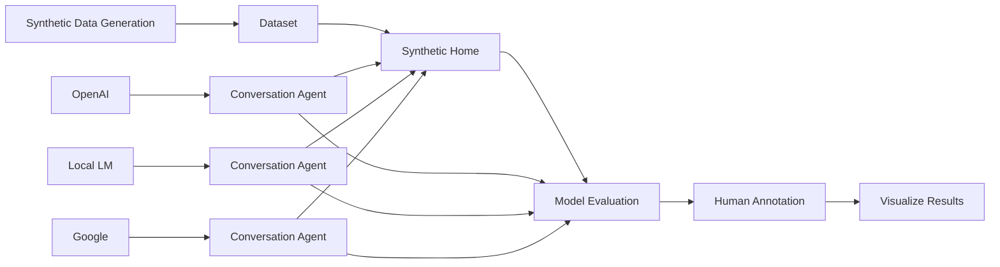
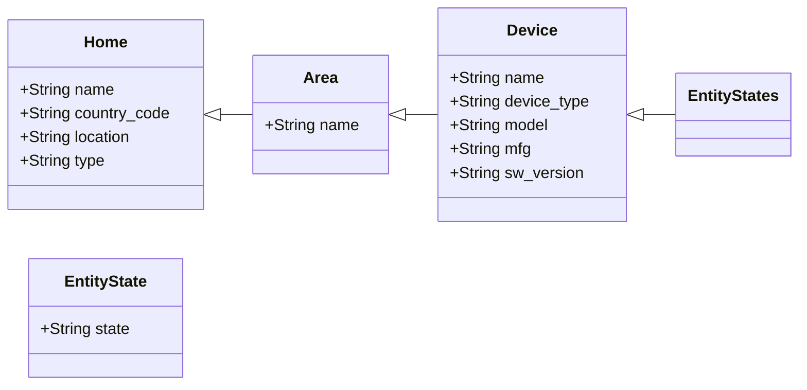

# Home Assistant Datasets

This package is a collection of datasets for evaluating AI Models in the context
of Home Assistant. The overall approach is:
- Synthetic Data Generation: Create synthetic datasets that represent a home
- Synthetic Home: Load the data into Home Assistant and exercise different device states (e.g. light on, off)
- Model Evaluation: Evaluate Home Assistant Conversation agents with different models (e.g. OpenAI, Google, local models)
- Human Annotation: Humans can annotate the results (e.g. great, ok, bad)
- Results Visualization: Track improvements over time with different models, prompts, tools, RAG, etc.

The idea would also be to start building datasets that can be used for training in the future.

## Synthetic Datasets

See the [datasets README](datasets/README.md) for details on the available
datasets including Home descriptions, Area descriptions, Device descriptions
and summaries that can be performed on a home.

The device level datasets are defined using the [Synthetic Home](https://github.com/allenporter/home-assistant-synthetic-home/)
format including its device registry of synthetic devices.

### Synthetic Data Generation

See the [generation README](generation/README.md) for more details on how synthetic
data generation using LLMs works. The data is generated from a small amount of seed
example data and a prompt, then is persisted.

The synthetic data generation is run with Jupyter notebooks.

## Model Evaluation

You can use the generated synthetic data in Home Assistat and with integrated
converation agents to produce outputs for evaluation.

This tool is meant to evaluate Home Automations. The initial target is an
end-to-end feature evaluation that requires human evaluation, and is not
automated or a low level evaluation. This will be evolved as more evaluation
use cases are added to keep it simple.

Model evaluation is currently performed with pytest, [Synthetic Home](https://github.com/allenporter/home-assistant-synthetic-home/), and any conversation agent (Open AI, Google, custom components, etc)

See the [evals/](evals/README.md) directory for more information on running the evaluation.

### Example Evaluation for Area Summaries

The initial use baseline use case of a model evaluation has the following steps:

- Configure the Synthetic Home and devices
- Configure the conversation agent and prompt ("summarize this area")
- Ask the conversation agent to summarize:
  - Each area of the home
  - For each interesting device state in the area (e.g. lights on, lights off)
- Record the results

These can be used for human evaluation to determine the model quality.

## Human Evaluation (WIP)

In this phase, we take the model outputs from a human rater and use them for
evaluation.

Human rater (me) scores the result quality:
  - 1: Low: Bad, incorrect, misleading, etc.
  - 2: Medium: Solid, not incorrect, though perhaps a missed opportunity
  - 3: High: Good

## Visualization (WIP)

Plot the annotated results to visualize the performance of the LLM models.
