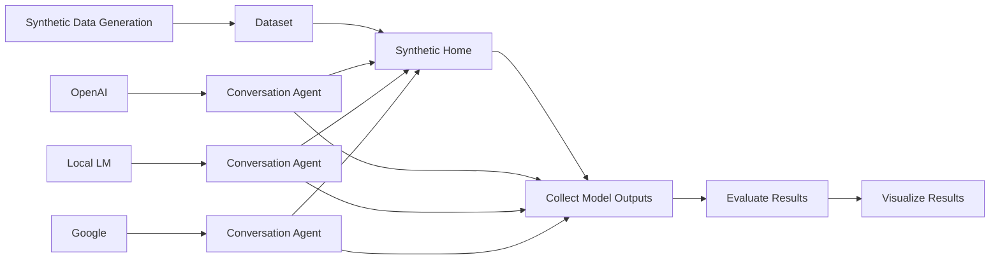
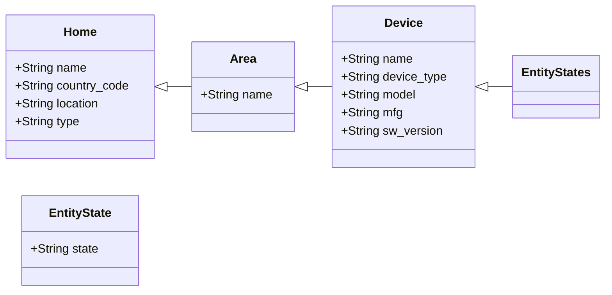

# Home Assistant Datasets

This package is a collection of datasets for evaluating AI Models in the context
of Home Assistant. The overall approach is:

- Synthetic Data Generation: Create synthetic datasets that represent a home
- Synthetic Home: Load the data into Home Assistant and exercise different device states (e.g. light on, off)
- Collect Model Outputs: Run the datasets with Home Assistant Conversation agents with different models (e.g. OpenAI, Google, local models) to generate model outputs (e.g. tool calls, responses)
- Evaluate Results: Evaluate the model outsputs with the groundtruth (e.g. is the action correct), or humans can annotate the results (e.g. great, ok, bad)
- Visualize Results: Track improvements over time with different models, prompts, tools, RAG, etc.

## Synthetic Datasets

See the [datasets README](datasets/README.md) for details on the available
datasets including Home descriptions, Area descriptions, Device descriptions
and summaries that can be performed on a home.

The device level datasets are defined using the [Synthetic Home](https://github.com/allenporter/home-assistant-synthetic-home/)
format including its device registry of synthetic devices.

### Synthetic Data Generation

See the [generation README](generation/README.md) for more details on how synthetic
data generation using LLMs works. The data is generated from a small amount of seed
example data and a prompt, then is persisted.

The synthetic data generation is run with Jupyter notebooks.

## Collect Model Outputs

You can use the generated synthetic data in Home Assistat and with integrated
conversation agents to produce outputs for evaluation.

Model evaluation is currently performed with pytest, [Synthetic Home](https://github.com/allenporter/home-assistant-synthetic-home/), and any conversation agent (Open AI, Google, custom components, etc)

See [docs/eval.md] for instructions on how run an evaluation and update the
leaderboard.

### Home Assistant Actions - Offline Evaluation

The most commonly used evaluation is for the Home Assistant conversation agent actions
for integrating with the assist pipeline. See the following dataset directories
for more information on running an evaluation:

- [datasets/assist](datasets/assist/README.md) - Dataset with a set of corner cases meant to challenge models on voice actions, but with a medium size home.
- [datasets/assist-mini](datasets/assist-mini/README.md) - A much simpler dataset set of tasks for smaller models using very limited number of entities.
- [datasets/intents](datasets/intents/README.md) - A dataset based on the home assistant intents repository unit tests that are used for the NLP model. These have a very large home.

Models are configured in `models/`.

### Home Assistant Automations - Offline Evaluation

We have an experimental dataset for zero show blueprint and automation creation,
set up in a similar in style to a Software Engineer Benchmark. Each record contains
a README with a description of the problem and expected results and a test eval
that loads the blueprints generated by a model and exercises to verify if the
solution is correct. See the dataset directory for more information:

- [datasets/automations](datasets/automations/README.md) - Dataset for blueprint and automation creation.

### Example Evaluation for Area Summaries

There are additional datasets for human evaluation of summarization tasks. These were the
initial use case for this repo. It works something like this:

- Configure the Synthetic Home and devices
- Configure the conversation agent and prompt ("summarize this area")
- Ask the conversation agent to summarize:
  - Each area of the home
  - For each interesting device state in the area (e.g. lights on, lights off)
- Record the results

These can be used for human evaluation to determine the model quality. In this phase, we take the model outputs from a human rater and use them for
evaluation.

Human rater (me) scores the result quality:

- 1: Low: Bad, incorrect, misleading, etc.
- 2: Medium: Solid, not incorrect, though perhaps a missed opportunity
- 3: High: Good

See the [script/](script/) directory for more details on preparing the data for
human eval procedure using Doccano.
