# Home LLM Leaderboard
| Model | assist (n=80) | assist-mini (n=49) | intents (n=165) |
| --- | --- | --- | --- |
| gemini-1.5-flash | 91.2% (CI:&nbsp;6.2%, 2024.6.3) | 98.0% (CI:&nbsp;4.0%, 2024.8.0dev) | 63.0% (CI:&nbsp;7.4%, 2024.8.0b) |
| gpt-4o-mini | 90.0% (CI:&nbsp;6.6%, 2024.8.0b) | 98.0% (CI:&nbsp;4.0%, 2024.8.0dev) | 63.6% (CI:&nbsp;7.3%, 2024.8.0b) |
| gpt-4o | 87.5% (CI:&nbsp;7.2%, 2024.6.3) |  | 81.2% (CI:&nbsp;6.0%, 2024.6.3) |
| gpt-3.5 | 75.0% (CI:&nbsp;9.5%, 2024.6.3) |  | 67.9% (CI:&nbsp;7.1%, 2024.6.3) |
| llama3.1 | 66.2% (CI:&nbsp;10.4%, 2024.9.0dev) | 83.7% (CI:&nbsp;10.3%, 2024.8.0b0) | 22.6% (CI:&nbsp;6.4%, 2024.8.0b) |
| functionary-small-v2.5 | 56.2% (CI:&nbsp;10.9%, 2024.7.0) | 63.3% (CI:&nbsp;13.5%, 2024.8.0dev) | 37.6% (CI:&nbsp;7.4%, 2024.6.3) |
| xlam-7b | 51.2% (CI:&nbsp;11.0%, 2024.9.0dev) | 85.7% (CI:&nbsp;9.8%, 2024.8.0b0) |  |
| home-llm | 45.0% (CI:&nbsp;10.9%, 2024.6.3) | 34.7% (CI:&nbsp;13.3%, 2024.8.0dev) | 25.5% (CI:&nbsp;6.6%, 2024.6.3) |
| assistant | 37.5% (CI:&nbsp;10.6%, 2024.6.3) | 63.3% (CI:&nbsp;13.5%, 2024.8.0dev) | 98.8% (CI:&nbsp;1.7%, 2024.6.3) |
| llama3-groq-tool-use | 20.0% (CI:&nbsp;8.8%, 2024.8.0b) | 51.0% (CI:&nbsp;14.0%, 2024.8.0b0) | 11.5% (CI:&nbsp;4.9%, 2024.8.0b) |
| mistral-v3 | 3.8% (CI:&nbsp;4.2%, 2024.8.0b) | 2.0% (CI:&nbsp;4.0%, 2024.8.0dev) | 10.3% (CI:&nbsp;4.6%, 2024.8.0b) |
| xlam-1b |  | 27.1% (CI:&nbsp;12.6%, 2024.8.0b0) |  |

Implementation notes:
- CI is large given small number of samples in the datasets.
- Note that not all models have been evaluated against all benchmarks. If a model is missing a run against a dataset, it just means it has not been evaluated.
- Error bars are std dev based on the # of tasks in the dataset.
- Local models evaluated using a GeForce GTX 1070 (8GB).
- Local models quantized with either Q4_K_M or Q4_0 but see links below for details.
- Temperature settings are based on the default values used in integrations.

## Datasets

### assist

A dataset built to exercise the Home Assistant LLM API. The homes for this
dataset were synthetically generated using gpt-3.5, and then manually curated
to exercise the Home Assistant intents for controlling devices. The sentences
were made intentionally more difficult than the existing assistant NLP for
showcasing larger model reasoning capabilities.

More information:
- https://github.com/allenporter/home-assistant-datasets/tree/main/datasets/assist
- https://developers.home-assistant.io/blog/2024/05/20/llm-api/

```mermaid
---
config:
    xyChart:
        width: 1500
        height: 800
        xAxis:
          labelFontSize: 12
          labelPadding: 8
    themeVariables:
        xyChart:
            titleColor: "#ff0000"
            plotColorPalette: "#1155cc, #ea4335, #f4b400, #0f9d58, #4285f4, #34a853, #6aa84f, #d5a6bd, #fbbc04, #ff6d01, #46bdc6, #4285f4"

---
xychart-beta
  title "assist"
  x-axis "Model" [assistant, gpt-3.5, gpt-4o, gpt-4o-mini, gemini-1.5-flash, functionary-small-v2.5, mistral-v3, llama3-groq-tool-use, llama3.1, xlam-7b, home-llm, .]
  y-axis "Score" 1 --> 100
  bar [37.5, 0.0, 0.0, 0.0, 0.0, 0.0, 0.0, 0.0, 0.0, 0.0, 0.0, 0.0]
  bar [0.0, 75.0, 0.0, 0.0, 0.0, 0.0, 0.0, 0.0, 0.0, 0.0, 0.0, 0.0]
  bar [0.0, 0.0, 87.5, 0.0, 0.0, 0.0, 0.0, 0.0, 0.0, 0.0, 0.0, 0.0]
  bar [0.0, 0.0, 0.0, 90.0, 0.0, 0.0, 0.0, 0.0, 0.0, 0.0, 0.0, 0.0]
  bar [0.0, 0.0, 0.0, 0.0, 91.2, 0.0, 0.0, 0.0, 0.0, 0.0, 0.0, 0.0]
  bar [0.0, 0.0, 0.0, 0.0, 0.0, 56.2, 0.0, 0.0, 0.0, 0.0, 0.0, 0.0]
  bar [0.0, 0.0, 0.0, 0.0, 0.0, 0.0, 3.8, 0.0, 0.0, 0.0, 0.0, 0.0]
  bar [0.0, 0.0, 0.0, 0.0, 0.0, 0.0, 0.0, 20.0, 0.0, 0.0, 0.0, 0.0]
  bar [0.0, 0.0, 0.0, 0.0, 0.0, 0.0, 0.0, 0.0, 66.2, 0.0, 0.0, 0.0]
  bar [0.0, 0.0, 0.0, 0.0, 0.0, 0.0, 0.0, 0.0, 0.0, 51.2, 0.0, 0.0]
  bar [0.0, 0.0, 0.0, 0.0, 0.0, 0.0, 0.0, 0.0, 0.0, 0.0, 45.0, 0.0]
  bar [0.0, 0.0, 0.0, 0.0, 0.0, 0.0, 0.0, 0.0, 0.0, 0.0, 0.0, -1.0]
```

### assist-mini

A dataset built to exercise the Home Assistant LLM API. The homes for this
dataset were synthetically generated using gpt-3.5, and then simplified for
exercising smaller LLMs. The use cases are not intented to be very tricky or
complicated and aimed at a smaller context window. The number of devices/entities
in each test is intentionally small (e.g. typically under 5 entities per test) to focus
on tool calling capabilities rather than context retrieval.

More information:
- https://github.com/allenporter/home-assistant-datasets/tree/main/datasets/assist-mini

```mermaid
---
config:
    xyChart:
        width: 1500
        height: 800
        xAxis:
          labelFontSize: 12
          labelPadding: 8
    themeVariables:
        xyChart:
            titleColor: "#ff0000"
            plotColorPalette: "#1155cc, #0f9d58, #4285f4, #34a853, #6aa84f, #d5a6bd, #fbbc04, #ff6d01, #46bdc6, #674ea7, #4285f4"

---
xychart-beta
  title "assist-mini"
  x-axis "Model" [assistant, gpt-4o-mini, gemini-1.5-flash, functionary-small-v2.5, mistral-v3, llama3-groq-tool-use, llama3.1, xlam-7b, home-llm, xlam-1b, .]
  y-axis "Score" 1 --> 100
  bar [63.3, 0.0, 0.0, 0.0, 0.0, 0.0, 0.0, 0.0, 0.0, 0.0, 0.0]
  bar [0.0, 98.0, 0.0, 0.0, 0.0, 0.0, 0.0, 0.0, 0.0, 0.0, 0.0]
  bar [0.0, 0.0, 98.0, 0.0, 0.0, 0.0, 0.0, 0.0, 0.0, 0.0, 0.0]
  bar [0.0, 0.0, 0.0, 63.3, 0.0, 0.0, 0.0, 0.0, 0.0, 0.0, 0.0]
  bar [0.0, 0.0, 0.0, 0.0, 2.0, 0.0, 0.0, 0.0, 0.0, 0.0, 0.0]
  bar [0.0, 0.0, 0.0, 0.0, 0.0, 51.0, 0.0, 0.0, 0.0, 0.0, 0.0]
  bar [0.0, 0.0, 0.0, 0.0, 0.0, 0.0, 83.7, 0.0, 0.0, 0.0, 0.0]
  bar [0.0, 0.0, 0.0, 0.0, 0.0, 0.0, 0.0, 85.7, 0.0, 0.0, 0.0]
  bar [0.0, 0.0, 0.0, 0.0, 0.0, 0.0, 0.0, 0.0, 34.7, 0.0, 0.0]
  bar [0.0, 0.0, 0.0, 0.0, 0.0, 0.0, 0.0, 0.0, 0.0, 27.1, 0.0]
  bar [0.0, 0.0, 0.0, 0.0, 0.0, 0.0, 0.0, 0.0, 0.0, 0.0, -1.0]
```

### intents

A dataset built form the Home Assitant intents repo, modeled after existing
NLP test cases for the assistant pipeline. This is mean to reuse the
tests that already exist for the NLP, which turns out to expose some
weaknesses or differences of interpretation of tasks. It also is a very large
home which is challenging for smaller models given the ~100 or so devices. Lastly,
there are some tests that have subtle mismatches that are reasonable (e.g.
"minimium brightness" tests)

More information:
- https://github.com/allenporter/home-assistant-datasets/tree/main/datasets/intents
- https://github.com/home-assistant/intents

```mermaid
---
config:
    xyChart:
        width: 1500
        height: 800
        xAxis:
          labelFontSize: 12
          labelPadding: 8
    themeVariables:
        xyChart:
            titleColor: "#ff0000"
            plotColorPalette: "#1155cc, #ea4335, #f4b400, #0f9d58, #4285f4, #34a853, #6aa84f, #d5a6bd, #fbbc04, #46bdc6, #4285f4"

---
xychart-beta
  title "intents"
  x-axis "Model" [assistant, gpt-3.5, gpt-4o, gpt-4o-mini, gemini-1.5-flash, functionary-small-v2.5, mistral-v3, llama3-groq-tool-use, llama3.1, home-llm, .]
  y-axis "Score" 1 --> 100
  bar [98.8, 0.0, 0.0, 0.0, 0.0, 0.0, 0.0, 0.0, 0.0, 0.0, 0.0]
  bar [0.0, 67.9, 0.0, 0.0, 0.0, 0.0, 0.0, 0.0, 0.0, 0.0, 0.0]
  bar [0.0, 0.0, 81.2, 0.0, 0.0, 0.0, 0.0, 0.0, 0.0, 0.0, 0.0]
  bar [0.0, 0.0, 0.0, 63.6, 0.0, 0.0, 0.0, 0.0, 0.0, 0.0, 0.0]
  bar [0.0, 0.0, 0.0, 0.0, 63.0, 0.0, 0.0, 0.0, 0.0, 0.0, 0.0]
  bar [0.0, 0.0, 0.0, 0.0, 0.0, 37.6, 0.0, 0.0, 0.0, 0.0, 0.0]
  bar [0.0, 0.0, 0.0, 0.0, 0.0, 0.0, 10.3, 0.0, 0.0, 0.0, 0.0]
  bar [0.0, 0.0, 0.0, 0.0, 0.0, 0.0, 0.0, 11.5, 0.0, 0.0, 0.0]
  bar [0.0, 0.0, 0.0, 0.0, 0.0, 0.0, 0.0, 0.0, 22.6, 0.0, 0.0]
  bar [0.0, 0.0, 0.0, 0.0, 0.0, 0.0, 0.0, 0.0, 0.0, 25.5, 0.0]
  bar [0.0, 0.0, 0.0, 0.0, 0.0, 0.0, 0.0, 0.0, 0.0, 0.0, -1.0]
```

## Models

### assistant

The Home Assisatnt NLP assistant pipeline

More information:
- https://github.com/home-assistant/hassil

### gpt-3.5

Open AI Conversation integration using gpt-3.5 (175B)

More information:
- https://platform.openai.com/docs/models/gpt-3-5-turbo

### gpt-4o

Open AI Conversation integration using gpt-4o

More information:
- https://platform.openai.com/docs/models/gpt-4o

### gpt-4o-mini

Open AI Conversation integration using gpt-4o-mini

More information:
- https://platform.openai.com/docs/models/gpt-4o-mini

### gemini-1.5-flash

Google Generative AI integration using gemini flash (v1.5)

More information:
- https://blog.google/products/gemini/google-gemini-new-features-july-2024/

### functionary-small-v2.5

A custom open AI integration using functionary small v2.5 (8B) with a modified pre-release llama cpp python server.

More information:
- https://huggingface.co/meetkai/functionary-small-v2.5
- https://github.com/abetlen/llama-cpp-python
- https://github.com/allenporter/functionary-server

### mistral-v3

Mistral V3 (7B) using Ollama

More information:
- https://huggingface.co/mistralai/Mistral-7B-Instruct-v0.3
- https://ollama.com/library/mistral
- https://mistral.ai/news/announcing-mistral-7b/

### llama3-groq-tool-use

Groq tool use model fine tuned from llama3 (8B) using Ollama with 8k contex window.

More information:
- https://ollama.com/library/llama3-groq-tool-use
- https://console.groq.com/docs/tool-use

### llama3.1

Llama 3.1 (8B) from Meta using Ollama with 8k contex window.

More information:
- https://huggingface.co/meta-llama/Meta-Llama-3.1-8B-Instruct
- https://ollama.com/library/llama3.1

### xlam-7b

XLam (7B) model from Salesforce using Ollama with 4k context window.

More information:
- https://huggingface.co/Salesforce/xLAM-7b-fc-r
- https://github.com/SalesforceAIResearch/xLAM
- https://ollama.com/allenporter/xlam:7b

### home-llm

The home-llm v3 model based on Phi (3B) and custom component using service calls to control Home Assistant.

More information:
- https://github.com/acon96/home-llm/
- https://huggingface.co/acon96/Home-3B-v3-GGUF
- https://ollama.com/fixt/home-3b-v3

### xlam-1b

XLam (1B) model from Salesforce using Ollama

More information:
- https://huggingface.co/Salesforce/xLAM-1b-fc-r
- https://github.com/SalesforceAIResearch/xLAM
- https://ollama.com/allenporter/xlam:1b
