# Home LLM Leaderboard
| Model | assist $${\color{gray}\small{\textsf{(n=80)}}}$$ | assist-mini $${\color{gray}\small{\textsf{(n=49)}}}$$ | automations $${\color{gray}\small{\textsf{(n=0)}}}$$ | questions $${\color{gray}\small{\textsf{(n=0)}}}$$ |
| --- | --- | --- | --- | --- |
| qwq | $${\textbf{96.2}\\% \space * \space\color{gray}\tiny{\textsf{(CI: 4.2, 2025.3.3)}}}$$ | $${98.0\\% \space\color{gray}\tiny{\textsf{(CI: 4.0, 2025.3.3)}}}$$ |  |  | $${\textbf{96.9}\\% \space * \space\color{gray}\tiny{\textsf{(CI: 3.0, avg)}}}$$ |
| claude-3-5-sonnet |  | $${95.9\\% \space\color{gray}\tiny{\textsf{(CI: 5.5, 2024.9.0b2)}}}$$ | $${\textbf{81.7}\\% \space * \space\color{gray}\tiny{\textsf{(CI: 9.8, 2025.3.0b)}}}$$ | $${57.1\\% \space\color{gray}\tiny{\textsf{(CI: 36.7, 2025.5.0b)}}}$$ | $${95.9\\% \space\color{gray}\tiny{\textsf{(CI: 5.5, avg)}}}$$ |
| gpt-4o-mini | $${92.5\\% \space\color{gray}\tiny{\textsf{(CI: 7.1, 2025.4.0b)}}}$$ | $${98.0\\% \space\color{gray}\tiny{\textsf{(CI: 4.0, 2024.8.0dev)}}}$$ | $${50.0\\% \space\color{gray}\tiny{\textsf{(CI: 12.7, 2025.3.0b)}}}$$ | $${45.5\\% \space\color{gray}\tiny{\textsf{(CI: 29.4, 2025.4.1)}}}$$ | $${95.1\\% \space\color{gray}\tiny{\textsf{(CI: 4.2, avg)}}}$$ |
| qwen2.5-32b | $${92.5\\% \space\color{gray}\tiny{\textsf{(CI: 5.8, 2025.3.3)}}}$$ | $${95.9\\% \space\color{gray}\tiny{\textsf{(CI: 5.5, 2025.3.3)}}}$$ |  |  | $${93.8\\% \space\color{gray}\tiny{\textsf{(CI: 4.2, avg)}}}$$ |
| gemini-1.5-flash | $${91.2\\% \space\color{gray}\tiny{\textsf{(CI: 6.2, 2024.6.3)}}}$$ | $${98.0\\% \space\color{gray}\tiny{\textsf{(CI: 4.0, 2024.8.0dev)}}}$$ | $${30.0\\% \space\color{gray}\tiny{\textsf{(CI: 11.6, 2025.3.0b)}}}$$ | $${27.3\\% \space\color{gray}\tiny{\textsf{(CI: 26.3, 2025.4.1)}}}$$ | $${93.8\\% \space\color{gray}\tiny{\textsf{(CI: 4.2, avg)}}}$$ |
| llama3.3 | $${92.5\\% \space\color{gray}\tiny{\textsf{(CI: 5.8, 2025.1.2)}}}$$ | $${91.8\\% \space\color{gray}\tiny{\textsf{(CI: 7.7, 2025.1.2)}}}$$ |  |  | $${92.2\\% \space\color{gray}\tiny{\textsf{(CI: 4.6, avg)}}}$$ |
| claude-3-5-haiku |  | $${91.8\\% \space\color{gray}\tiny{\textsf{(CI: 7.7, 2025.2.4)}}}$$ | $${63.3\\% \space\color{gray}\tiny{\textsf{(CI: 12.2, 2025.3.0b)}}}$$ |  | $${91.8\\% \space\color{gray}\tiny{\textsf{(CI: 7.7, avg)}}}$$ |
| llama3.3-awq | $${86.2\\% \space\color{gray}\tiny{\textsf{(CI: 7.5, 2025.1.2)}}}$$ | $${\textbf{100.0}\\% \space * \space\color{gray}\tiny{\textsf{(CI: 0.0, 2025.1.2)}}}$$ |  |  | $${91.5\\% \space\color{gray}\tiny{\textsf{(CI: 4.8, avg)}}}$$ |
| gpt-3.5 | $${80.0\\% \space\color{gray}\tiny{\textsf{(CI: 8.8, 2025.2.4)}}}$$ | $${\textbf{100.0}\\% \space * \space\color{gray}\tiny{\textsf{(CI: 0.0, 2025.4.0b)}}}$$ | $${53.3\\% \space\color{gray}\tiny{\textsf{(CI: 12.6, 2025.3.0b)}}}$$ | $${\textbf{63.6}\\% \space * \space\color{gray}\tiny{\textsf{(CI: 28.4, 2025.4.1)}}}$$ | $${87.6\\% \space\color{gray}\tiny{\textsf{(CI: 5.7, avg)}}}$$ |
| gemma3-27b | $${86.2\\% \space\color{gray}\tiny{\textsf{(CI: 7.5, 2025.3.3)}}}$$ |  |  |  | $${86.2\\% \space\color{gray}\tiny{\textsf{(CI: 7.5, avg)}}}$$ |
| qwen2.5 | $${81.2\\% \space\color{gray}\tiny{\textsf{(CI: 8.6, 2024.9.2)}}}$$ | $${89.8\\% \space\color{gray}\tiny{\textsf{(CI: 8.5, 2025.4.0b)}}}$$ |  |  | $${84.5\\% \space\color{gray}\tiny{\textsf{(CI: 6.2, avg)}}}$$ |
| mistral-nemo |  | $${81.6\\% \space\color{gray}\tiny{\textsf{(CI: 10.8, 2024.9.2)}}}$$ |  |  | $${81.6\\% \space\color{gray}\tiny{\textsf{(CI: 10.8, avg)}}}$$ |
| qwen2.5-14b | $${78.8\\% \space\color{gray}\tiny{\textsf{(CI: 9.0, 2025.3.3)}}}$$ | $${85.7\\% \space\color{gray}\tiny{\textsf{(CI: 9.8, 2025.3.3)}}}$$ |  |  | $${81.4\\% \space\color{gray}\tiny{\textsf{(CI: 6.7, avg)}}}$$ |
| gemini-2.0-flash | $${72.5\\% \space\color{gray}\tiny{\textsf{(CI: 9.8, 2025.4.0b)}}}$$ | $${93.9\\% \space\color{gray}\tiny{\textsf{(CI: 6.7, 2025.4.0b)}}}$$ | $${68.3\\% \space\color{gray}\tiny{\textsf{(CI: 11.8, 2025.3.0b)}}}$$ | $${36.4\\% \space\color{gray}\tiny{\textsf{(CI: 28.4, 2025.4.1)}}}$$ | $${80.6\\% \space\color{gray}\tiny{\textsf{(CI: 6.8, avg)}}}$$ |
| llama3.1 | $${66.2\\% \space\color{gray}\tiny{\textsf{(CI: 10.4, 2024.9.0dev)}}}$$ | $${89.8\\% \space\color{gray}\tiny{\textsf{(CI: 8.5, 2025.4.0b)}}}$$ |  | $${18.2\\% \space\color{gray}\tiny{\textsf{(CI: 22.8, 2025.4.1)}}}$$ | $${75.2\\% \space\color{gray}\tiny{\textsf{(CI: 7.5, avg)}}}$$ |
| llama3.2-3b | $${62.5\\% \space\color{gray}\tiny{\textsf{(CI: 10.6, 2024.9.2)}}}$$ | $${81.6\\% \space\color{gray}\tiny{\textsf{(CI: 10.8, 2024.9.2)}}}$$ |  |  | $${69.8\\% \space\color{gray}\tiny{\textsf{(CI: 7.9, avg)}}}$$ |
| gemini-2.5-pro | $${68.4\\% \space\color{gray}\tiny{\textsf{(CI: 20.9, 2025.4.1)}}}$$ |  |  |  | $${68.4\\% \space\color{gray}\tiny{\textsf{(CI: 20.9, avg)}}}$$ |
| gemini-2.0-flash-lite | $${67.5\\% \space\color{gray}\tiny{\textsf{(CI: 10.3, 2025.4.1)}}}$$ |  |  |  | $${67.5\\% \space\color{gray}\tiny{\textsf{(CI: 10.3, avg)}}}$$ |
| gemma3-4b | $${63.7\\% \space\color{gray}\tiny{\textsf{(CI: 10.5, 2025.3.3)}}}$$ |  |  |  | $${63.7\\% \space\color{gray}\tiny{\textsf{(CI: 10.5, avg)}}}$$ |
| assistant | $${37.5\\% \space\color{gray}\tiny{\textsf{(CI: 10.6, 2024.6.3)}}}$$ | $${63.3\\% \space\color{gray}\tiny{\textsf{(CI: 13.5, 2024.8.0dev)}}}$$ |  |  | $${47.3\\% \space\color{gray}\tiny{\textsf{(CI: 8.6, avg)}}}$$ |
| llama3.2-1b | $${7.5\\% \space\color{gray}\tiny{\textsf{(CI: 5.8, 2024.9.2)}}}$$ | $${4.1\\% \space\color{gray}\tiny{\textsf{(CI: 5.5, 2024.9.2)}}}$$ |  |  | $${6.2\\% \space\color{gray}\tiny{\textsf{(CI: 4.2, avg)}}}$$ |

Implementation notes:
- CI is large given small number of samples in the datasets.
- Note that not all models have been evaluated against all benchmarks. If a model is missing a run against a dataset, it just means it has not been evaluated.
- Error bars are std dev based on the # of tasks in the dataset.
- Local models quantized with either Q4_K_M or Q4_0 but see links below for details.
- Most small local models evaluated using a GeForce GTX 1070 (8GB). Larger models were contributed by other hardware mixes.
- Temperature settings are based on the default values used in integrations.

## Datasets

### assist

A dataset built to exercise the Home Assistant LLM API. The homes for this
dataset were synthetically generated using gpt-3.5, and then manually curated
to exercise the Home Assistant intents for controlling devices. The sentences
were made intentionally more difficult than the existing assistant NLP for
showcasing larger model reasoning capabilities.

More information:
- https://github.com/allenporter/home-assistant-datasets/tree/main/datasets/assist
- https://developers.home-assistant.io/blog/2024/05/20/llm-api/

```mermaid
---
config:
    xyChart:
        width: 1500
        height: 800
        xAxis:
          labelFontSize: 12
          labelPadding: 8
    themeVariables:
        xyChart:
            titleColor: "#ff0000"
            plotColorPalette: "#4285f4, #f4b400, #ea4335, #fbbc04, #34a853, #46bdc6, #1155cc, #d5a6bd, #6aa84f, #d9ead3, #4285f4, #0f9d58, #4285f4"

---
xychart-beta
  title "assist"
  x-axis "Model" [qwq, gpt-4o-mini, qwen2.5-32b, gemini-1.5-flash, llama3.3, llama3.3-awq, gpt-3.5, gemma3-27b, qwen2.5, qwen2.5-14b, gemini-2.0-flash, llama3.1, .]
  y-axis "Score" 1 --> 100
  bar [96.2, 0.0, 0.0, 0.0, 0.0, 0.0, 0.0, 0.0, 0.0, 0.0, 0.0, 0.0, 0.0]
  bar [0.0, 92.5, 0.0, 0.0, 0.0, 0.0, 0.0, 0.0, 0.0, 0.0, 0.0, 0.0, 0.0]
  bar [0.0, 0.0, 92.5, 0.0, 0.0, 0.0, 0.0, 0.0, 0.0, 0.0, 0.0, 0.0, 0.0]
  bar [0.0, 0.0, 0.0, 91.2, 0.0, 0.0, 0.0, 0.0, 0.0, 0.0, 0.0, 0.0, 0.0]
  bar [0.0, 0.0, 0.0, 0.0, 92.5, 0.0, 0.0, 0.0, 0.0, 0.0, 0.0, 0.0, 0.0]
  bar [0.0, 0.0, 0.0, 0.0, 0.0, 86.2, 0.0, 0.0, 0.0, 0.0, 0.0, 0.0, 0.0]
  bar [0.0, 0.0, 0.0, 0.0, 0.0, 0.0, 80.0, 0.0, 0.0, 0.0, 0.0, 0.0, 0.0]
  bar [0.0, 0.0, 0.0, 0.0, 0.0, 0.0, 0.0, 86.2, 0.0, 0.0, 0.0, 0.0, 0.0]
  bar [0.0, 0.0, 0.0, 0.0, 0.0, 0.0, 0.0, 0.0, 81.2, 0.0, 0.0, 0.0, 0.0]
  bar [0.0, 0.0, 0.0, 0.0, 0.0, 0.0, 0.0, 0.0, 0.0, 78.8, 0.0, 0.0, 0.0]
  bar [0.0, 0.0, 0.0, 0.0, 0.0, 0.0, 0.0, 0.0, 0.0, 0.0, 72.5, 0.0, 0.0]
  bar [0.0, 0.0, 0.0, 0.0, 0.0, 0.0, 0.0, 0.0, 0.0, 0.0, 0.0, 66.2, 0.0]
  bar [0.0, 0.0, 0.0, 0.0, 0.0, 0.0, 0.0, 0.0, 0.0, 0.0, 0.0, 0.0, -1.0]
```

### assist-mini

A dataset built to exercise the Home Assistant LLM API. The homes for this
dataset were synthetically generated using gpt-3.5, and then simplified for
exercising smaller LLMs. The use cases are not intended to be very tricky or
complicated and aimed at a smaller context window. The number of devices/entities
in each test is intentionally small (e.g. typically under 5 entities per test) to focus
on tool calling capabilities rather than context retrieval.

More information:
- https://github.com/allenporter/home-assistant-datasets/tree/main/datasets/assist-mini

```mermaid
---
config:
    xyChart:
        width: 1500
        height: 800
        xAxis:
          labelFontSize: 12
          labelPadding: 8
    themeVariables:
        xyChart:
            titleColor: "#ff0000"
            plotColorPalette: "#4285f4, #0f9d58, #f4b400, #ea4335, #fbbc04, #34a853, #ff6d01, #46bdc6, #1155cc, #6aa84f, #674ea7, #d9ead3, #4285f4"

---
xychart-beta
  title "assist-mini"
  x-axis "Model" [qwq, claude-3-5-sonnet, gpt-4o-mini, qwen2.5-32b, gemini-1.5-flash, llama3.3, claude-3-5-haiku, llama3.3-awq, gpt-3.5, qwen2.5, mistral-nemo, qwen2.5-14b, .]
  y-axis "Score" 1 --> 100
  bar [98.0, 0.0, 0.0, 0.0, 0.0, 0.0, 0.0, 0.0, 0.0, 0.0, 0.0, 0.0, 0.0]
  bar [0.0, 95.9, 0.0, 0.0, 0.0, 0.0, 0.0, 0.0, 0.0, 0.0, 0.0, 0.0, 0.0]
  bar [0.0, 0.0, 98.0, 0.0, 0.0, 0.0, 0.0, 0.0, 0.0, 0.0, 0.0, 0.0, 0.0]
  bar [0.0, 0.0, 0.0, 95.9, 0.0, 0.0, 0.0, 0.0, 0.0, 0.0, 0.0, 0.0, 0.0]
  bar [0.0, 0.0, 0.0, 0.0, 98.0, 0.0, 0.0, 0.0, 0.0, 0.0, 0.0, 0.0, 0.0]
  bar [0.0, 0.0, 0.0, 0.0, 0.0, 91.8, 0.0, 0.0, 0.0, 0.0, 0.0, 0.0, 0.0]
  bar [0.0, 0.0, 0.0, 0.0, 0.0, 0.0, 91.8, 0.0, 0.0, 0.0, 0.0, 0.0, 0.0]
  bar [0.0, 0.0, 0.0, 0.0, 0.0, 0.0, 0.0, 100.0, 0.0, 0.0, 0.0, 0.0, 0.0]
  bar [0.0, 0.0, 0.0, 0.0, 0.0, 0.0, 0.0, 0.0, 100.0, 0.0, 0.0, 0.0, 0.0]
  bar [0.0, 0.0, 0.0, 0.0, 0.0, 0.0, 0.0, 0.0, 0.0, 89.8, 0.0, 0.0, 0.0]
  bar [0.0, 0.0, 0.0, 0.0, 0.0, 0.0, 0.0, 0.0, 0.0, 0.0, 81.6, 0.0, 0.0]
  bar [0.0, 0.0, 0.0, 0.0, 0.0, 0.0, 0.0, 0.0, 0.0, 0.0, 0.0, 85.7, 0.0]
  bar [0.0, 0.0, 0.0, 0.0, 0.0, 0.0, 0.0, 0.0, 0.0, 0.0, 0.0, 0.0, -1.0]
```

### automations

A dataset for evaluating automation generation. The homes for this dataset were
synthetically generated using gpt-3.5. This dataset is in development and contains
just a few initial examples. Each benchmark creates a synthetic home fixture
and configures the entities with a particular state, then asks for an automation
for a specific set of devices.

The benchmark loads a synthetic home and runs pytest with Home Assistant to
run through scenarios that should trigger the automation. It also gives points
for getting inputs correct and each problem benchmark exercises different
scenarios that add to the overall score. The various scenarios are not weighted.

More information:
- https://github.com/allenporter/home-assistant-datasets/tree/main/datasets/automations

```mermaid
---
config:
    xyChart:
        width: 1500
        height: 800
        xAxis:
          labelFontSize: 12
          labelPadding: 8
    themeVariables:
        xyChart:
            titleColor: "#ff0000"
            plotColorPalette: "#0f9d58, #f4b400, #fbbc04, #ff6d01, #1155cc, #4285f4, #4285f4"

---
xychart-beta
  title "automations"
  x-axis "Model" [claude-3-5-sonnet, gpt-4o-mini, gemini-1.5-flash, claude-3-5-haiku, gpt-3.5, gemini-2.0-flash, .]
  y-axis "Score" 1 --> 100
  bar [81.7, 0.0, 0.0, 0.0, 0.0, 0.0, 0.0]
  bar [0.0, 50.0, 0.0, 0.0, 0.0, 0.0, 0.0]
  bar [0.0, 0.0, 30.0, 0.0, 0.0, 0.0, 0.0]
  bar [0.0, 0.0, 0.0, 63.3, 0.0, 0.0, 0.0]
  bar [0.0, 0.0, 0.0, 0.0, 53.3, 0.0, 0.0]
  bar [0.0, 0.0, 0.0, 0.0, 0.0, 68.3, 0.0]
  bar [0.0, 0.0, 0.0, 0.0, 0.0, 0.0, -1.0]
```

### questions

A dataset built to exercise question and answering capabilities of the Home
Assistant LLM API. The homes for this dataset were synthetically generated
and then manually curated to exercise the Home Assistant
intents for querying device state.

This dataset is currently in development and is not yet complete. It may
contain bugs or incomplete data. We welcome contributions to improve the
dataset. Please see repo docs for more information on how to contribute.

More information:
- https://github.com/allenporter/home-assistant-datasets/tree/main/datasets/questions

```mermaid
---
config:
    xyChart:
        width: 1500
        height: 800
        xAxis:
          labelFontSize: 12
          labelPadding: 8
    themeVariables:
        xyChart:
            titleColor: "#ff0000"
            plotColorPalette: "#0f9d58, #f4b400, #fbbc04, #1155cc, #4285f4, #0f9d58, #4285f4"

---
xychart-beta
  title "questions"
  x-axis "Model" [claude-3-5-sonnet, gpt-4o-mini, gemini-1.5-flash, gpt-3.5, gemini-2.0-flash, llama3.1, .]
  y-axis "Score" 1 --> 100
  bar [57.1, 0.0, 0.0, 0.0, 0.0, 0.0, 0.0]
  bar [0.0, 45.5, 0.0, 0.0, 0.0, 0.0, 0.0]
  bar [0.0, 0.0, 27.3, 0.0, 0.0, 0.0, 0.0]
  bar [0.0, 0.0, 0.0, 63.6, 0.0, 0.0, 0.0]
  bar [0.0, 0.0, 0.0, 0.0, 36.4, 0.0, 0.0]
  bar [0.0, 0.0, 0.0, 0.0, 0.0, 18.2, 0.0]
  bar [0.0, 0.0, 0.0, 0.0, 0.0, 0.0, -1.0]
```

## Models

### assistant

The Home Assisatnt NLP assistant pipeline

More information:
- https://github.com/home-assistant/hassil

### claude-3-5-haiku

Anthropic integration using Claude 3.5 Haiku

More information:
- https://www.anthropic.com/news/3-5-models-and-computer-use

### claude-3-5-sonnet

Anthropic integration using Claude 3.5 Sonnet

More information:
- https://www.anthropic.com/news/claude-3-5-sonnet

### gemini-1.5-flash

Google Generative AI integration using gemini flash (v1.5)

More information:
- https://blog.google/products/gemini/google-gemini-new-features-july-2024/

### gemini-2.0-flash-lite

Google Generative AI integration using gemini flash lite (v2.0) (exp)

More information:
- https://developers.googleblog.com/en/start-building-with-the-gemini-2-0-flash-family/

### gemini-2.0-flash

Google Generative AI integration using gemini flash (v2.0)

More information:
- https://blog.google/technology/google-deepmind/google-gemini-ai-update-december-2024/

### gemini-2.5-pro

Google Generative AI integration using Gemini 2.5, a thinking model, designed
to tackle increasingly complex problems.

More information:
- https://blog.google/technology/google-deepmind/gemini-model-thinking-updates-march-2025/

### gemma3-27b

Gemma3 is a lightweight variant of Gemini 2.0 models. This is a variant
that has been customized to support tool use since the current ollama
variant does not yet support tools.

More information:
- https://ollama.com/PetrosStav/gemma3-tools
- https://blog.google/technology/developers/gemma-3/

### gemma3-4b

Gemma3 is a lightweight variant of Gemini 2.0 models. This is a variant
that has been customized to support tool use since the current ollama
variant does not yet support tools.

More information:
- https://ollama.com/PetrosStav/gemma3-tools
- https://blog.google/technology/developers/gemma-3/

### gpt-3.5

Open AI Conversation integration using gpt-3.5 (175B)

More information:
- https://platform.openai.com/docs/models/gpt-3-5-turbo

### gpt-4o-mini

Open AI Conversation integration using gpt-4o-mini

More information:
- https://platform.openai.com/docs/models/gpt-4o-mini

### llama3.1

Llama 3.1 (8B) from Meta using Ollama with 8k t window.

More information:
- https://huggingface.co/meta-llama/Meta-Llama-3.1-8B-Instruct
- https://ollama.com/library/llama3.1

### llama3.2-1b

Meta's Llama 3.2 goes small with 1B and 3B models.

More information:
- https://huggingface.co/meta-llama/Llama-3.2-1B
- https://ollama.com/library/llama3.2:1b

### llama3.2-3b

Meta's Llama 3.2 goes small with 1B and 3B models.

More information:
- https://huggingface.co/meta-llama/Llama-3.2-3B
- https://ollama.com/library/llama3.2:3b

### llama3.3-awq

Llama 3.3 AWQ running in an OpenAI API-compatible server

More information:
- https://huggingface.co/casperhansen/llama-3.3-70b-instruct-awq
- https://huggingface.co/docs/transformers/en/quantization/awq

### llama3.3

Llama 3.3 (70B) from Meta using Ollama

More information:
- https://ollama.com/library/llama3.3

### mistral-nemo

A state-of-the-art 12B model with 128k context length, built by Mistral AI in collaboration with NVIDIA.

More information:
- https://mistral.ai/news/mistral-nemo/
- https://ollama.com/library/mistral-nemo

### qwen2.5-14b

Qwen2.5 models are pretrained on Alibaba's latest large-scale dataset, encompassing up to 18 trillion tokens. The model supports up to 128K tokens and has multilingual support.

More information:
- https://qwenlm.github.io/blog/qwen2.5/
- https://ollama.com/library/qwen2.5

### qwen2.5-32b

Qwen2.5 models are pretrained on Alibaba's latest large-scale dataset, encompassing up to 18 trillion tokens. The model supports up to 128K tokens and has multilingual support.

More information:
- https://qwenlm.github.io/blog/qwen2.5/
- https://ollama.com/library/qwen2.5

### qwen2.5

Qwen2.5 models are pretrained on Alibaba's latest large-scale dataset, encompassing up to 18 trillion tokens. The model supports up to 128K tokens and has multilingual support.

More information:
- https://qwenlm.github.io/blog/qwen2.5/
- https://ollama.com/library/qwen2.5

### qwq

QwQ is the reasoning model of the Qwen series.

More information:
- https://qwenlm.github.io/blog/qwq-32b/
- https://ollama.com/library/qwq
