# Home LLM Leaderboard
| Model | assist $${\color{gray}\small{\textsf{(n=460)}}}$$ | assist-mini $${\color{gray}\small{\textsf{(n=196)}}}$$ | questions $${\color{gray}\small{\textsf{(n=370)}}}$$ | automations $${\color{gray}\small{\textsf{(n=60)}}}$$ |
| --- | --- | --- | --- | --- |
| gemini-2.5-flash | $${88.7\\% \space\color{gray}\tiny{\textsf{(CI: 2.9, 2025.4.3)}}}$$ | $${96.9\\% \space\color{gray}\tiny{\textsf{(CI: 2.4, 2025.7.1)}}}$$ | $${\textbf{94.6}\\% \space * \space\color{gray}\tiny{\textsf{(CI: 2.3, 2025.7.1)}}}$$ | $${73.3\\% \space\color{gray}\tiny{\textsf{(CI: 11.2, 2025.4.3)}}}$$ | $${\textbf{92.4}\\% \space * \space\color{gray}\tiny{\textsf{(CI: 1.6, avg)}}}$$ |
| gemini-2.5-pro | $${\textbf{91.3}\\% \space * \space\color{gray}\tiny{\textsf{(CI: 2.6, 2025.4.3)}}}$$ | $${98.5\\% \space\color{gray}\tiny{\textsf{(CI: 1.7, 2025.4.3)}}}$$ | $${83.2\\% \space\color{gray}\tiny{\textsf{(CI: 5.4, 2025.4.3)}}}$$ | $${76.7\\% \space\color{gray}\tiny{\textsf{(CI: 10.7, 2025.4.3)}}}$$ | $${91.2\\% \space\color{gray}\tiny{\textsf{(CI: 1.9, avg)}}}$$ |
| claude-3-7-sonnet | $${89.4\\% \space\color{gray}\tiny{\textsf{(CI: 2.9, 2025.4.3)}}}$$ | $${\textbf{100.0}\\% \space * \space\color{gray}\tiny{\textsf{(CI: 0.0, 2025.4.3)}}}$$ | $${84.1\\% \space\color{gray}\tiny{\textsf{(CI: 5.4, 2025.4.3)}}}$$ | $${\textbf{81.7}\\% \space * \space\color{gray}\tiny{\textsf{(CI: 9.8, 2025.4.3)}}}$$ | $${90.8\\% \space\color{gray}\tiny{\textsf{(CI: 2.0, avg)}}}$$ |
| claude-3-5-haiku | $${85.4\\% \space\color{gray}\tiny{\textsf{(CI: 3.2, 2025.4.3)}}}$$ | $${94.4\\% \space\color{gray}\tiny{\textsf{(CI: 3.2, 2025.4.3)}}}$$ | $${87.0\\% \space\color{gray}\tiny{\textsf{(CI: 4.8, 2025.4.3)}}}$$ | $${56.7\\% \space\color{gray}\tiny{\textsf{(CI: 12.5, 2025.4.3)}}}$$ | $${87.9\\% \space\color{gray}\tiny{\textsf{(CI: 2.2, avg)}}}$$ |
| gpt-4.1-mini | $${86.3\\% \space\color{gray}\tiny{\textsf{(CI: 3.1, 2025.4.3)}}}$$ | $${98.0\\% \space\color{gray}\tiny{\textsf{(CI: 2.0, 2025.4.3)}}}$$ | $${83.5\\% \space\color{gray}\tiny{\textsf{(CI: 3.8, 2025.5.0.dev0)}}}$$ | $${56.7\\% \space\color{gray}\tiny{\textsf{(CI: 12.5, 2025.4.3)}}}$$ | $${87.5\\% \space\color{gray}\tiny{\textsf{(CI: 2.0, avg)}}}$$ |
| gemini-2.5-flash-lite | $${84.6\\% \space\color{gray}\tiny{\textsf{(CI: 3.3, 2025.7.1)}}}$$ | $${93.4\\% \space\color{gray}\tiny{\textsf{(CI: 3.5, 2025.7.1)}}}$$ | $${87.6\\% \space\color{gray}\tiny{\textsf{(CI: 3.4, 2025.7.1)}}}$$ | $${48.3\\% \space\color{gray}\tiny{\textsf{(CI: 12.6, 2025.7.1)}}}$$ | $${87.3\\% \space\color{gray}\tiny{\textsf{(CI: 2.0, avg)}}}$$ |
| gpt-4o-mini | $${85.9\\% \space\color{gray}\tiny{\textsf{(CI: 3.2, 2025.4.3)}}}$$ | $${98.5\\% \space\color{gray}\tiny{\textsf{(CI: 1.7, 2025.4.3)}}}$$ | $${75.1\\% \space\color{gray}\tiny{\textsf{(CI: 6.2, 2025.4.3)}}}$$ | $${56.7\\% \space\color{gray}\tiny{\textsf{(CI: 12.5, 2025.4.3)}}}$$ | $${86.4\\% \space\color{gray}\tiny{\textsf{(CI: 2.3, avg)}}}$$ |
| gpt-4.1 | $${81.2\\% \space\color{gray}\tiny{\textsf{(CI: 3.6, 2025.4.3)}}}$$ | $${96.9\\% \space\color{gray}\tiny{\textsf{(CI: 2.4, 2025.4.3)}}}$$ | $${85.4\\% \space\color{gray}\tiny{\textsf{(CI: 5.1, 2025.4.3)}}}$$ | $${76.7\\% \space\color{gray}\tiny{\textsf{(CI: 10.7, 2025.4.3)}}}$$ | $${85.8\\% \space\color{gray}\tiny{\textsf{(CI: 2.4, avg)}}}$$ |
| gpt-3.5 | $${86.5\\% \space\color{gray}\tiny{\textsf{(CI: 3.1, 2025.4.3)}}}$$ | $${99.5\\% \space\color{gray}\tiny{\textsf{(CI: 1.0, 2025.4.3)}}}$$ | $${73.2\\% \space\color{gray}\tiny{\textsf{(CI: 4.5, 2025.5.0.dev0)}}}$$ | $${66.7\\% \space\color{gray}\tiny{\textsf{(CI: 11.9, 2025.4.3)}}}$$ | $${84.2\\% \space\color{gray}\tiny{\textsf{(CI: 2.2, avg)}}}$$ |
| gemini-1.5-flash | $${88.9\\% \space\color{gray}\tiny{\textsf{(CI: 2.9, 2025.4.3)}}}$$ | $${96.9\\% \space\color{gray}\tiny{\textsf{(CI: 2.4, 2025.4.3)}}}$$ | $${70.8\\% \space\color{gray}\tiny{\textsf{(CI: 4.6, 2025.5.0.dev0)}}}$$ | $${28.3\\% \space\color{gray}\tiny{\textsf{(CI: 11.4, 2025.4.3)}}}$$ | $${83.9\\% \space\color{gray}\tiny{\textsf{(CI: 2.2, avg)}}}$$ |
| qwen2.5-70b | $${85.7\\% \space\color{gray}\tiny{\textsf{(CI: 3.2, 2025.4.4)}}}$$ | $${94.3\\% \space\color{gray}\tiny{\textsf{(CI: 3.3, 2025.4.4)}}}$$ | $${74.0\\% \space\color{gray}\tiny{\textsf{(CI: 4.7, 2025.4.4)}}}$$ | $${0.0\\% \space\color{gray}\tiny{\textsf{(CI: 0.0, 2025.4.4)}}}$$ | $${83.3\\% \space\color{gray}\tiny{\textsf{(CI: 2.3, avg)}}}$$ |
| qwen2.5-32b | $${85.0\\% \space\color{gray}\tiny{\textsf{(CI: 3.3, 2025.4.4)}}}$$ | $${97.9\\% \space\color{gray}\tiny{\textsf{(CI: 2.0, 2025.4.4)}}}$$ | $${70.2\\% \space\color{gray}\tiny{\textsf{(CI: 4.7, 2025.4.4)}}}$$ | $${0.0\\% \space\color{gray}\tiny{\textsf{(CI: 0.0, 2025.4.4)}}}$$ | $${82.0\\% \space\color{gray}\tiny{\textsf{(CI: 2.4, avg)}}}$$ |
| qwen2.5-14b | $${79.1\\% \space\color{gray}\tiny{\textsf{(CI: 3.7, 2025.4.4)}}}$$ | $${95.4\\% \space\color{gray}\tiny{\textsf{(CI: 2.9, 2025.4.4)}}}$$ | $${71.4\\% \space\color{gray}\tiny{\textsf{(CI: 4.7, 2025.4.4)}}}$$ | $${3.3\\% \space\color{gray}\tiny{\textsf{(CI: 4.5, 2025.4.4)}}}$$ | $${79.6\\% \space\color{gray}\tiny{\textsf{(CI: 2.5, avg)}}}$$ |
| qwen3-30b-gptq | $${84.6\\% \space\color{gray}\tiny{\textsf{(CI: 3.3, 2025.5.2)}}}$$ | $${98.0\\% \space\color{gray}\tiny{\textsf{(CI: 2.0, 2025.5.2)}}}$$ | $${63.2\\% \space\color{gray}\tiny{\textsf{(CI: 4.9, 2025.5.2)}}}$$ | $${8.3\\% \space\color{gray}\tiny{\textsf{(CI: 7.0, 2025.5.2)}}}$$ | $${79.4\\% \space\color{gray}\tiny{\textsf{(CI: 2.5, avg)}}}$$ |
| qwen2.5-7b | $${79.8\\% \space\color{gray}\tiny{\textsf{(CI: 3.7, 2025.4.4)}}}$$ | $${88.3\\% \space\color{gray}\tiny{\textsf{(CI: 4.5, 2025.4.4)}}}$$ | $${72.7\\% \space\color{gray}\tiny{\textsf{(CI: 4.5, 2025.4.4)}}}$$ | $${0.0\\% \space\color{gray}\tiny{\textsf{(CI: 0.0, 2025.4.4)}}}$$ | $${78.8\\% \space\color{gray}\tiny{\textsf{(CI: 2.5, avg)}}}$$ |
| gpt-4.1-nano | $${74.7\\% \space\color{gray}\tiny{\textsf{(CI: 4.0, 2025.4.3)}}}$$ | $${92.9\\% \space\color{gray}\tiny{\textsf{(CI: 3.6, 2025.4.3)}}}$$ | $${75.9\\% \space\color{gray}\tiny{\textsf{(CI: 4.4, 2025.5.0.dev0)}}}$$ | $${46.7\\% \space\color{gray}\tiny{\textsf{(CI: 12.6, 2025.4.3)}}}$$ | $${78.6\\% \space\color{gray}\tiny{\textsf{(CI: 2.5, avg)}}}$$ |
| gemini-2.0-flash | $${68.7\\% \space\color{gray}\tiny{\textsf{(CI: 4.2, 2025.4.3)}}}$$ | $${90.3\\% \space\color{gray}\tiny{\textsf{(CI: 4.1, 2025.4.3)}}}$$ | $${78.4\\% \space\color{gray}\tiny{\textsf{(CI: 5.9, 2025.4.3)}}}$$ | $${71.7\\% \space\color{gray}\tiny{\textsf{(CI: 11.4, 2025.4.3)}}}$$ | $${75.9\\% \space\color{gray}\tiny{\textsf{(CI: 2.9, avg)}}}$$ |
| qwen3-4b | $${68.0\\% \space\color{gray}\tiny{\textsf{(CI: 4.3, 2025.7.1)}}}$$ | $${70.9\\% \space\color{gray}\tiny{\textsf{(CI: 6.4, 2025.7.1)}}}$$ | $${76.8\\% \space\color{gray}\tiny{\textsf{(CI: 4.3, 2025.7.1)}}}$$ | $${0.0\\% \space\color{gray}\tiny{\textsf{(CI: 0.0, 2025.7.1)}}}$$ | $${71.7\\% \space\color{gray}\tiny{\textsf{(CI: 2.8, avg)}}}$$ |
| gemini-2.0-flash-lite | $${65.9\\% \space\color{gray}\tiny{\textsf{(CI: 4.3, 2025.4.3)}}}$$ | $${88.3\\% \space\color{gray}\tiny{\textsf{(CI: 4.5, 2025.4.3)}}}$$ | $${63.2\\% \space\color{gray}\tiny{\textsf{(CI: 4.9, 2025.5.0.dev0)}}}$$ | $${53.3\\% \space\color{gray}\tiny{\textsf{(CI: 12.6, 2025.4.3)}}}$$ | $${69.2\\% \space\color{gray}\tiny{\textsf{(CI: 2.8, avg)}}}$$ |
| qwen2.5-3b | $${60.9\\% \space\color{gray}\tiny{\textsf{(CI: 4.5, 2025.4.4)}}}$$ | $${70.9\\% \space\color{gray}\tiny{\textsf{(CI: 6.4, 2025.4.4)}}}$$ | $${59.7\\% \space\color{gray}\tiny{\textsf{(CI: 5.0, 2025.4.4)}}}$$ | $${0.0\\% \space\color{gray}\tiny{\textsf{(CI: 0.0, 2025.4.4)}}}$$ | $${62.4\\% \space\color{gray}\tiny{\textsf{(CI: 3.0, avg)}}}$$ |
| qwen2.5-0.5b | $${18.5\\% \space\color{gray}\tiny{\textsf{(CI: 3.5, 2025.4.4)}}}$$ | $${24.5\\% \space\color{gray}\tiny{\textsf{(CI: 6.0, 2025.4.4)}}}$$ | $${35.9\\% \space\color{gray}\tiny{\textsf{(CI: 4.9, 2025.4.4)}}}$$ | $${0.0\\% \space\color{gray}\tiny{\textsf{(CI: 0.0, 2025.4.4)}}}$$ | $${25.9\\% \space\color{gray}\tiny{\textsf{(CI: 2.7, avg)}}}$$ |

Implementation notes:
- CI is large given small number of samples in the datasets.
- Note that not all models have been evaluated against all benchmarks. If a model is missing a run against a dataset, it just means it has not been evaluated.
- Error bars are std dev based on the # of tasks in the dataset.
- Local models quantized with either Q4_K_M or Q4_0 but see links below for details.
- Most small local models evaluated using a GeForce GTX 1070 (8GB). Larger models were contributed by other hardware mixes.
- Temperature settings are based on the default values used in integrations.

## Datasets

### assist

A dataset built to exercise the Home Assistant LLM API. The homes for this
dataset were synthetically generated using gpt-3.5, and then manually curated
to exercise the Home Assistant intents for controlling devices. The sentences
were made intentionally more difficult than the existing assistant NLP for
showcasing larger model reasoning capabilities.

More information:
- https://github.com/allenporter/home-assistant-datasets/tree/main/datasets/assist
- https://developers.home-assistant.io/blog/2024/05/20/llm-api/

```mermaid
---
config:
    xyChart:
        width: 1500
        height: 800
        xAxis:
          labelFontSize: 12
          labelPadding: 8
    themeVariables:
        xyChart:
            titleColor: "#ff0000"
            plotColorPalette: "#4285f4, #0f9d58, #f4b400, #ea4335, #fbbc04, #34a853, #ff6d01, #46bdc6, #1155cc, #d5a6bd, #6aa84f, #674ea7, #4285f4"

---
xychart-beta
  title "assist"
  x-axis "Model" [gemini-2.5-flash, gemini-2.5-pro, claude-3-7-sonnet, claude-3-5-haiku, gpt-4.1-mini, gemini-2.5-flash-lite, gpt-4o-mini, gpt-4.1, gpt-3.5, gemini-1.5-flash, qwen2.5-70b, qwen2.5-32b, .]
  y-axis "Score" 1 --> 100
  bar [88.7, 0.0, 0.0, 0.0, 0.0, 0.0, 0.0, 0.0, 0.0, 0.0, 0.0, 0.0, 0.0]
  bar [0.0, 91.3, 0.0, 0.0, 0.0, 0.0, 0.0, 0.0, 0.0, 0.0, 0.0, 0.0, 0.0]
  bar [0.0, 0.0, 89.4, 0.0, 0.0, 0.0, 0.0, 0.0, 0.0, 0.0, 0.0, 0.0, 0.0]
  bar [0.0, 0.0, 0.0, 85.4, 0.0, 0.0, 0.0, 0.0, 0.0, 0.0, 0.0, 0.0, 0.0]
  bar [0.0, 0.0, 0.0, 0.0, 86.3, 0.0, 0.0, 0.0, 0.0, 0.0, 0.0, 0.0, 0.0]
  bar [0.0, 0.0, 0.0, 0.0, 0.0, 84.6, 0.0, 0.0, 0.0, 0.0, 0.0, 0.0, 0.0]
  bar [0.0, 0.0, 0.0, 0.0, 0.0, 0.0, 85.9, 0.0, 0.0, 0.0, 0.0, 0.0, 0.0]
  bar [0.0, 0.0, 0.0, 0.0, 0.0, 0.0, 0.0, 81.2, 0.0, 0.0, 0.0, 0.0, 0.0]
  bar [0.0, 0.0, 0.0, 0.0, 0.0, 0.0, 0.0, 0.0, 86.5, 0.0, 0.0, 0.0, 0.0]
  bar [0.0, 0.0, 0.0, 0.0, 0.0, 0.0, 0.0, 0.0, 0.0, 88.9, 0.0, 0.0, 0.0]
  bar [0.0, 0.0, 0.0, 0.0, 0.0, 0.0, 0.0, 0.0, 0.0, 0.0, 85.7, 0.0, 0.0]
  bar [0.0, 0.0, 0.0, 0.0, 0.0, 0.0, 0.0, 0.0, 0.0, 0.0, 0.0, 85.0, 0.0]
  bar [0.0, 0.0, 0.0, 0.0, 0.0, 0.0, 0.0, 0.0, 0.0, 0.0, 0.0, 0.0, -1.0]
```

### assist-mini

A dataset built to exercise the Home Assistant LLM API. The homes for this
dataset were synthetically generated using gpt-3.5, and then simplified for
exercising smaller LLMs.

This is a variation on the `assist` dataset that tests far fewer entities, devices,
and areas at once. This is designed given poor performance of local models on the
`assist` baseline to help with even smaller tasks to focus on to improve quailty.

The use cases are not intended to be very tricky or complicated and aimed at a
smaller context window. The number of devices/entities in each test is intentionally
small (e.g. typically under 5 entities per test) to focus on tool calling capabilities
rather than context retrieval.

This dataset uses the `assist` format. See the `assist` dataset card and README for
additional details about the format and information about running the evaluation.

More information:
- https://github.com/allenporter/home-assistant-datasets/tree/main/datasets/assist
- https://github.com/allenporter/home-assistant-datasets/tree/main/datasets/assist-mini

```mermaid
---
config:
    xyChart:
        width: 1500
        height: 800
        xAxis:
          labelFontSize: 12
          labelPadding: 8
    themeVariables:
        xyChart:
            titleColor: "#ff0000"
            plotColorPalette: "#4285f4, #0f9d58, #f4b400, #ea4335, #fbbc04, #34a853, #ff6d01, #46bdc6, #1155cc, #d5a6bd, #6aa84f, #674ea7, #4285f4"

---
xychart-beta
  title "assist-mini"
  x-axis "Model" [gemini-2.5-flash, gemini-2.5-pro, claude-3-7-sonnet, claude-3-5-haiku, gpt-4.1-mini, gemini-2.5-flash-lite, gpt-4o-mini, gpt-4.1, gpt-3.5, gemini-1.5-flash, qwen2.5-70b, qwen2.5-32b, .]
  y-axis "Score" 1 --> 100
  bar [96.9, 0.0, 0.0, 0.0, 0.0, 0.0, 0.0, 0.0, 0.0, 0.0, 0.0, 0.0, 0.0]
  bar [0.0, 98.5, 0.0, 0.0, 0.0, 0.0, 0.0, 0.0, 0.0, 0.0, 0.0, 0.0, 0.0]
  bar [0.0, 0.0, 100.0, 0.0, 0.0, 0.0, 0.0, 0.0, 0.0, 0.0, 0.0, 0.0, 0.0]
  bar [0.0, 0.0, 0.0, 94.4, 0.0, 0.0, 0.0, 0.0, 0.0, 0.0, 0.0, 0.0, 0.0]
  bar [0.0, 0.0, 0.0, 0.0, 98.0, 0.0, 0.0, 0.0, 0.0, 0.0, 0.0, 0.0, 0.0]
  bar [0.0, 0.0, 0.0, 0.0, 0.0, 93.4, 0.0, 0.0, 0.0, 0.0, 0.0, 0.0, 0.0]
  bar [0.0, 0.0, 0.0, 0.0, 0.0, 0.0, 98.5, 0.0, 0.0, 0.0, 0.0, 0.0, 0.0]
  bar [0.0, 0.0, 0.0, 0.0, 0.0, 0.0, 0.0, 96.9, 0.0, 0.0, 0.0, 0.0, 0.0]
  bar [0.0, 0.0, 0.0, 0.0, 0.0, 0.0, 0.0, 0.0, 99.5, 0.0, 0.0, 0.0, 0.0]
  bar [0.0, 0.0, 0.0, 0.0, 0.0, 0.0, 0.0, 0.0, 0.0, 96.9, 0.0, 0.0, 0.0]
  bar [0.0, 0.0, 0.0, 0.0, 0.0, 0.0, 0.0, 0.0, 0.0, 0.0, 94.3, 0.0, 0.0]
  bar [0.0, 0.0, 0.0, 0.0, 0.0, 0.0, 0.0, 0.0, 0.0, 0.0, 0.0, 97.9, 0.0]
  bar [0.0, 0.0, 0.0, 0.0, 0.0, 0.0, 0.0, 0.0, 0.0, 0.0, 0.0, 0.0, -1.0]
```

### questions

A dataset built to exercise question and answering capabilities of the Home
Assistant LLM API. The homes for this dataset were synthetically generated
and then manually curated to exercise the Home Assistant
intents for querying device state.

This dataset is currently in development and is not yet complete. It may
contain bugs or incomplete data. We welcome contributions to improve the
dataset. Please see repo docs for more information on how to contribute.

More information:
- https://github.com/allenporter/home-assistant-datasets/tree/main/datasets/questions

```mermaid
---
config:
    xyChart:
        width: 1500
        height: 800
        xAxis:
          labelFontSize: 12
          labelPadding: 8
    themeVariables:
        xyChart:
            titleColor: "#ff0000"
            plotColorPalette: "#4285f4, #0f9d58, #f4b400, #ea4335, #fbbc04, #34a853, #ff6d01, #46bdc6, #1155cc, #d5a6bd, #6aa84f, #674ea7, #4285f4"

---
xychart-beta
  title "questions"
  x-axis "Model" [gemini-2.5-flash, gemini-2.5-pro, claude-3-7-sonnet, claude-3-5-haiku, gpt-4.1-mini, gemini-2.5-flash-lite, gpt-4o-mini, gpt-4.1, gpt-3.5, gemini-1.5-flash, qwen2.5-70b, qwen2.5-32b, .]
  y-axis "Score" 1 --> 100
  bar [94.6, 0.0, 0.0, 0.0, 0.0, 0.0, 0.0, 0.0, 0.0, 0.0, 0.0, 0.0, 0.0]
  bar [0.0, 83.2, 0.0, 0.0, 0.0, 0.0, 0.0, 0.0, 0.0, 0.0, 0.0, 0.0, 0.0]
  bar [0.0, 0.0, 84.1, 0.0, 0.0, 0.0, 0.0, 0.0, 0.0, 0.0, 0.0, 0.0, 0.0]
  bar [0.0, 0.0, 0.0, 87.0, 0.0, 0.0, 0.0, 0.0, 0.0, 0.0, 0.0, 0.0, 0.0]
  bar [0.0, 0.0, 0.0, 0.0, 83.5, 0.0, 0.0, 0.0, 0.0, 0.0, 0.0, 0.0, 0.0]
  bar [0.0, 0.0, 0.0, 0.0, 0.0, 87.6, 0.0, 0.0, 0.0, 0.0, 0.0, 0.0, 0.0]
  bar [0.0, 0.0, 0.0, 0.0, 0.0, 0.0, 75.1, 0.0, 0.0, 0.0, 0.0, 0.0, 0.0]
  bar [0.0, 0.0, 0.0, 0.0, 0.0, 0.0, 0.0, 85.4, 0.0, 0.0, 0.0, 0.0, 0.0]
  bar [0.0, 0.0, 0.0, 0.0, 0.0, 0.0, 0.0, 0.0, 73.2, 0.0, 0.0, 0.0, 0.0]
  bar [0.0, 0.0, 0.0, 0.0, 0.0, 0.0, 0.0, 0.0, 0.0, 70.8, 0.0, 0.0, 0.0]
  bar [0.0, 0.0, 0.0, 0.0, 0.0, 0.0, 0.0, 0.0, 0.0, 0.0, 74.0, 0.0, 0.0]
  bar [0.0, 0.0, 0.0, 0.0, 0.0, 0.0, 0.0, 0.0, 0.0, 0.0, 0.0, 70.2, 0.0]
  bar [0.0, 0.0, 0.0, 0.0, 0.0, 0.0, 0.0, 0.0, 0.0, 0.0, 0.0, 0.0, -1.0]
```

### automations

A dataset for evaluating automation generation. The homes for this dataset were
synthetically generated using gpt-3.5. This dataset is in development and contains
just a few initial examples. Each benchmark creates a synthetic home fixture
and configures the entities with a particular state, then asks for an automation
for a specific set of devices.

The benchmark loads a synthetic home and runs pytest with Home Assistant to
run through scenarios that should trigger the automation. It also gives points
for getting inputs correct and each problem benchmark exercises different
scenarios that add to the overall score. The various scenarios are not weighted.

More information:
- https://github.com/allenporter/home-assistant-datasets/tree/main/datasets/automations

```mermaid
---
config:
    xyChart:
        width: 1500
        height: 800
        xAxis:
          labelFontSize: 12
          labelPadding: 8
    themeVariables:
        xyChart:
            titleColor: "#ff0000"
            plotColorPalette: "#4285f4, #0f9d58, #f4b400, #ea4335, #fbbc04, #34a853, #ff6d01, #46bdc6, #1155cc, #d5a6bd, #d9ead3, #4285f4, #4285f4"

---
xychart-beta
  title "automations"
  x-axis "Model" [gemini-2.5-flash, gemini-2.5-pro, claude-3-7-sonnet, claude-3-5-haiku, gpt-4.1-mini, gemini-2.5-flash-lite, gpt-4o-mini, gpt-4.1, gpt-3.5, gemini-1.5-flash, qwen2.5-14b, qwen3-30b-gptq, .]
  y-axis "Score" 1 --> 100
  bar [73.3, 0.0, 0.0, 0.0, 0.0, 0.0, 0.0, 0.0, 0.0, 0.0, 0.0, 0.0, 0.0]
  bar [0.0, 76.7, 0.0, 0.0, 0.0, 0.0, 0.0, 0.0, 0.0, 0.0, 0.0, 0.0, 0.0]
  bar [0.0, 0.0, 81.7, 0.0, 0.0, 0.0, 0.0, 0.0, 0.0, 0.0, 0.0, 0.0, 0.0]
  bar [0.0, 0.0, 0.0, 56.7, 0.0, 0.0, 0.0, 0.0, 0.0, 0.0, 0.0, 0.0, 0.0]
  bar [0.0, 0.0, 0.0, 0.0, 56.7, 0.0, 0.0, 0.0, 0.0, 0.0, 0.0, 0.0, 0.0]
  bar [0.0, 0.0, 0.0, 0.0, 0.0, 48.3, 0.0, 0.0, 0.0, 0.0, 0.0, 0.0, 0.0]
  bar [0.0, 0.0, 0.0, 0.0, 0.0, 0.0, 56.7, 0.0, 0.0, 0.0, 0.0, 0.0, 0.0]
  bar [0.0, 0.0, 0.0, 0.0, 0.0, 0.0, 0.0, 76.7, 0.0, 0.0, 0.0, 0.0, 0.0]
  bar [0.0, 0.0, 0.0, 0.0, 0.0, 0.0, 0.0, 0.0, 66.7, 0.0, 0.0, 0.0, 0.0]
  bar [0.0, 0.0, 0.0, 0.0, 0.0, 0.0, 0.0, 0.0, 0.0, 28.3, 0.0, 0.0, 0.0]
  bar [0.0, 0.0, 0.0, 0.0, 0.0, 0.0, 0.0, 0.0, 0.0, 0.0, 3.3, 0.0, 0.0]
  bar [0.0, 0.0, 0.0, 0.0, 0.0, 0.0, 0.0, 0.0, 0.0, 0.0, 0.0, 8.3, 0.0]
  bar [0.0, 0.0, 0.0, 0.0, 0.0, 0.0, 0.0, 0.0, 0.0, 0.0, 0.0, 0.0, -1.0]
```

## Models

### claude-3-5-haiku

Anthropic integration using Claude 3.5 Haiku, a model with intelligence at
blazing speeds

More information:
- https://www.anthropic.com/news/3-5-models-and-computer-use

### claude-3-7-sonnet

Anthropic integration using Claude 3.7 Sonnet, high level of intelligence and
capability with toggleable extended thinking

More information:
- https://www.anthropic.com/news/claude-3-7-sonnet

### gemini-1.5-flash

Google Generative AI integration using gemini flash (v1.5)

#### Assist Eval Performance Metrics

- Average Latency: 1016 (ms)
- Total Eval Cost: $0.09
- Cost breakdown:
    - 1086109 input tokens, $0.08/1M tokens
    - 9731 output tokens, $0.30/1M tokens

Free tier is available

More information:
- https://blog.google/products/gemini/google-gemini-new-features-july-2024/

### gemini-2.0-flash-lite

Google Generative AI integration using gemini flash lite (v2.0) (exp)

#### Assist Eval Performance Metrics

- Average Latency: 894 (ms)
- Total Eval Cost: $0.08
- Cost breakdown:
    - 952834 input tokens, $0.08/1M tokens
    - 10079 output tokens, $0.30/1M tokens

Free tier is available

More information:
- https://developers.googleblog.com/en/start-building-with-the-gemini-2-0-flash-family/

### gemini-2.0-flash

Google Generative AI integration using gemini flash (v2.0)

#### Assist Eval Performance Metrics

- Average Latency: 963 (ms)
- Total Eval Cost: $0.10
- Cost breakdown:
    - 980948 input tokens, $0.10/1M tokens
    - 9339 output tokens, $0.40/1M tokens

Free tier is available

More information:
- https://blog.google/technology/google-deepmind/google-gemini-ai-update-december-2024/

### gemini-2.5-flash-lite

A Gemini 2.5 Flash model optimized for cost efficiency and low latency.

More information:
- https://blog.google/products/gemini/gemini-2-5-model-family-expands/
- https://ai.google.dev/gemini-api/docs/models#gemini-2.5-flash-lite

### gemini-2.5-flash

Google Generative AI integration using gemini flash (v2.5)

#### Assist Eval Performance Metrics

- Average Latency: 2262 (ms)
- Total Eval Cost: $0.94
- Cost breakdown:
    - 2092631 input tokens, $0.30/1M tokens
    - 126680 output tokens, $2.50/1M tokens

Free tier is available

More information:
- https://developers.googleblog.com/en/start-building-with-gemini-25-flash/

### gemini-2.5-pro

Google Generative AI integration using Gemini 2.5, a thinking model, designed
to tackle increasingly complex problems.

#### Assist Eval Performance Metrics

- Average Latency: 5760 (ms)
- Total Eval Cost: $4.66
- Cost breakdown:
    - 2241457 input tokens, $1.25/1M tokens
    - 186050 output tokens, $10.00/1M tokens

Free tier is available

More information:
- https://blog.google/technology/google-deepmind/gemini-model-thinking-updates-march-2025/

### gpt-3.5

Open AI Conversation integration using gpt-3.5 (175B)

#### Assist Eval Performance Metrics

- Average Latency: 2091 (ms)
- Total Eval Cost: $0.79
- Cost breakdown:
    - 1527892 input tokens, $0.50/1M tokens
    - 16438 output tokens, $1.50/1M tokens

None

More information:
- https://platform.openai.com/docs/models/gpt-3-5-turbo

### gpt-4.1-mini

Open AI Conversation integration using gpt-4.1-mini. This model is
balanced for intelligence, speed, and cost.

#### Assist Eval Performance Metrics

- Average Latency: 2610 (ms)
- Total Eval Cost: $0.64
- Cost breakdown:
    - 1532960 input tokens, $0.40/1M tokens
    - 16536 output tokens, $1.60/1M tokens

None

More information:
- https://platform.openai.com/docs/models/gpt-4.1-mini

### gpt-4.1-nano

Open AI Conversation integration using gpt-4.1-minanoni. This model is the
fastest, most cost-effective GPT-4.1 model

#### Assist Eval Performance Metrics

- Average Latency: 1987 (ms)
- Total Eval Cost: $0.15
- Cost breakdown:
    - 1445903 input tokens, $0.10/1M tokens
    - 14185 output tokens, $0.40/1M tokens

None

More information:
- https://platform.openai.com/docs/models/gpt-4.1-nano

### gpt-4.1

Open AI Conversation integration using gpt-4.1. This is a
flagship GPT model for complex tasks

#### Assist Eval Performance Metrics

- Average Latency: 2263 (ms)
- Total Eval Cost: $3.09
- Cost breakdown:
    - 1480022 input tokens, $2.00/1M tokens
    - 16561 output tokens, $8.00/1M tokens

None

More information:
- https://platform.openai.com/docs/models/gpt-4.1

### gpt-4o-mini

Open AI Conversation integration using gpt-4o-mini

#### Assist Eval Performance Metrics

- Average Latency: 2519 (ms)
- Total Eval Cost: $0.23
- Cost breakdown:
    - 1500077 input tokens, $0.15/1M tokens
    - 16166 output tokens, $0.60/1M tokens

None

More information:
- https://platform.openai.com/docs/models/gpt-4o-mini

### qwen2.5-0.5b

Qwen2.5 models are pretrained on Alibaba's latest large-scale dataset, encompassing up to 18 trillion tokens. The model supports up to 128K tokens and has multilingual support.

More information:
- https://qwenlm.github.io/blog/qwen2.5/
- https://ollama.com/library/qwen2.5

### qwen2.5-14b

Qwen2.5 models are pretrained on Alibaba's latest large-scale dataset, encompassing up to 18 trillion tokens. The model supports up to 128K tokens and has multilingual support.

More information:
- https://qwenlm.github.io/blog/qwen2.5/
- https://ollama.com/library/qwen2.5

### qwen2.5-32b

Qwen2.5 models are pretrained on Alibaba's latest large-scale dataset, encompassing up to 18 trillion tokens. The model supports up to 128K tokens and has multilingual support.

More information:
- https://qwenlm.github.io/blog/qwen2.5/
- https://ollama.com/library/qwen2.5

### qwen2.5-3b

Qwen2.5 models are pretrained on Alibaba's latest large-scale dataset, encompassing up to 18 trillion tokens. The model supports up to 128K tokens and has multilingual support.

More information:
- https://qwenlm.github.io/blog/qwen2.5/
- https://ollama.com/library/qwen2.5

### qwen2.5-70b

Qwen2.5 models are pretrained on Alibaba's latest large-scale dataset, encompassing up to 18 trillion tokens. The model supports up to 128K tokens and has multilingual support.

More information:
- https://qwenlm.github.io/blog/qwen2.5/
- https://ollama.com/library/qwen2.5

### qwen2.5-7b

Qwen2.5 models are pretrained on Alibaba's latest large-scale dataset, encompassing up to 18 trillion tokens. The model supports up to 128K tokens and has multilingual support.

More information:
- https://qwenlm.github.io/blog/qwen2.5/
- https://ollama.com/library/qwen2.5

### qwen3-30b-gptq

Qwen3 30B (A3B) running in an OpenAI API-compatible server

More information:
- https://huggingface.co/Qwen/Qwen3-30B-A3B-GPTQ-Int4
- https://huggingface.co/docs/transformers/en/quantization/gptq

### qwen3-4b

Qwen3 is the large language model series developed by Qwen team, Alibaba Cloud. Quen improvies on Qwen2.5, with weights of Qwen3 available to the public, including both dense and Mixture-of-Expert (MoE) models.

More information:
- https://qwenlm.github.io/blog/qwen3/
- https://ollama.com/library/qwen3
