# LLM Leaderboard
| Model | assist | assist-mini | intents |
| --- | --- | --- | --- |
| gemini-1.5-flash | 91.2% (+/- 3.2%) 2024.6.3 | 98.0% (+/- 2.0%) 2024.8.0dev | 0.0% (+/- 0.0%)  |
| gpt-4o-mini | 90.0% (+/- 3.4%) 2024.8.0b | 98.0% (+/- 2.0%) 2024.8.0dev | 63.6% (+/- 3.7%) 2024.8.0b |
| gpt-4o | 87.5% (+/- 3.7%) 2024.6.3 | 0.0% (+/- 0.0%)  | 81.2% (+/- 3.0%) 2024.6.3 |
| gpt-3.5 | 75.0% (+/- 4.8%) 2024.6.3 | 0.0% (+/- 0.0%)  | 67.9% (+/- 3.6%) 2024.6.3 |
| functionary-small-v2.5 | 56.2% (+/- 5.5%) 2024.7.0 | 63.3% (+/- 6.9%) 2024.8.0dev | 37.6% (+/- 3.8%) 2024.6.3 |
| llama3.1 | 45.6% (+/- 5.6%) 2024.8.0b | 83.7% (+/- 5.3%) 2024.8.0b0 | 22.6% (+/- 3.3%) 2024.8.0b |
| home-llm | 45.0% (+/- 5.6%) 2024.6.3 | 34.7% (+/- 6.8%) 2024.8.0dev | 25.5% (+/- 3.4%) 2024.6.3 |
| assistant | 37.5% (+/- 5.4%) 2024.6.3 | 63.3% (+/- 6.9%) 2024.8.0dev | 98.8% (+/- 0.9%) 2024.6.3 |
| xlam-7b | 25.0% (+/- 4.8%) 2024.8.0b | 85.7% (+/- 5.0%) 2024.8.0b0 | 0.0% (+/- 0.0%)  |
| llama3-groq-tool-use | 20.0% (+/- 4.5%) 2024.8.0b | 51.0% (+/- 7.1%) 2024.8.0b0 | 11.5% (+/- 2.5%) 2024.8.0b |
| mistral-v3 | 3.8% (+/- 2.1%) 2024.8.0b | 2.0% (+/- 2.0%) 2024.8.0dev | 10.3% (+/- 2.4%) 2024.8.0b |
| xlam-1b | 0.0% (+/- 0.0%)  | 27.1% (+/- 6.4%) 2024.8.0b0 | 0.0% (+/- 0.0%)  |
## Datasets

### assist

A dataset built to exercise the Home Assistant LLM API. The homes for this
dataset were synthetically generated using gpt-3.5, and then manually curated
to exercise the Home Assistant intents for controlling devices. The sentences
were made intentionally more difficult than the existing assistant NLP for
showcasing larger model reasoning capabilities.

More information:
- https://github.com/allenporter/home-assistant-datasets/tree/main/datasets/assist
- https://developers.home-assistant.io/blog/2024/05/20/llm-api/

```mermaid
---
config:
    xyChart:
        width: 1500
        height: 800
        xAxis:
          labelFontSize: 12
          labelPadding: 8
    themeVariables:
        xyChart:
            titleColor: "#ff0000"
            plotColorPalette: "#46bdc6, #ea4335, #f4b400, #0f9d58, #4285f4, #fbbc04, #6aa84f, #d5a6bd, #34a853, #1155cc, #ff6d01"

---
xychart-beta
  title "assist"
  x-axis "Model" [assistant, gpt-3.5, gpt-4o, gpt-4o-mini, gemini-1.5-flash, functionary-small-v2.5, mistral-v3, llama3-groq-tool-use, llama3.1, xlam-7b, home-llm]
  y-axis "Score" 1 --> 100
  bar [37.5, 0.0, 0.0, 0.0, 0.0, 0.0, 0.0, 0.0, 0.0, 0.0, 0.0]
  bar [0.0, 75.0, 0.0, 0.0, 0.0, 0.0, 0.0, 0.0, 0.0, 0.0, 0.0]
  bar [0.0, 0.0, 87.5, 0.0, 0.0, 0.0, 0.0, 0.0, 0.0, 0.0, 0.0]
  bar [0.0, 0.0, 0.0, 90.0, 0.0, 0.0, 0.0, 0.0, 0.0, 0.0, 0.0]
  bar [0.0, 0.0, 0.0, 0.0, 91.2, 0.0, 0.0, 0.0, 0.0, 0.0, 0.0]
  bar [0.0, 0.0, 0.0, 0.0, 0.0, 56.2, 0.0, 0.0, 0.0, 0.0, 0.0]
  bar [0.0, 0.0, 0.0, 0.0, 0.0, 0.0, 3.8, 0.0, 0.0, 0.0, 0.0]
  bar [0.0, 0.0, 0.0, 0.0, 0.0, 0.0, 0.0, 20.0, 0.0, 0.0, 0.0]
  bar [0.0, 0.0, 0.0, 0.0, 0.0, 0.0, 0.0, 0.0, 45.6, 0.0, 0.0]
  bar [0.0, 0.0, 0.0, 0.0, 0.0, 0.0, 0.0, 0.0, 0.0, 25.0, 0.0]
  bar [0.0, 0.0, 0.0, 0.0, 0.0, 0.0, 0.0, 0.0, 0.0, 0.0, 45.0]
```

### assist-mini

A dataset built to exercise the Home Assistant LLM API. The homes for this
dataset were synthetically generated using gpt-3.5, and then simplified for
exercising smaller LLMs. The use cases are not intented to be very tricky or
complicated and aimed at a smaller context window.

More information:
- https://github.com/allenporter/home-assistant-datasets/tree/main/datasets/assist-mini

```mermaid
---
config:
    xyChart:
        width: 1500
        height: 800
        xAxis:
          labelFontSize: 12
          labelPadding: 8
    themeVariables:
        xyChart:
            titleColor: "#ff0000"
            plotColorPalette: "#46bdc6, #0f9d58, #4285f4, #fbbc04, #6aa84f, #d5a6bd, #34a853, #1155cc, #ff6d01, #674ea7"

---
xychart-beta
  title "assist-mini"
  x-axis "Model" [assistant, gpt-4o-mini, gemini-1.5-flash, functionary-small-v2.5, mistral-v3, llama3-groq-tool-use, llama3.1, xlam-7b, home-llm, xlam-1b]
  y-axis "Score" 1 --> 100
  bar [63.3, 0.0, 0.0, 0.0, 0.0, 0.0, 0.0, 0.0, 0.0, 0.0]
  bar [0.0, 98.0, 0.0, 0.0, 0.0, 0.0, 0.0, 0.0, 0.0, 0.0]
  bar [0.0, 0.0, 98.0, 0.0, 0.0, 0.0, 0.0, 0.0, 0.0, 0.0]
  bar [0.0, 0.0, 0.0, 63.3, 0.0, 0.0, 0.0, 0.0, 0.0, 0.0]
  bar [0.0, 0.0, 0.0, 0.0, 2.0, 0.0, 0.0, 0.0, 0.0, 0.0]
  bar [0.0, 0.0, 0.0, 0.0, 0.0, 51.0, 0.0, 0.0, 0.0, 0.0]
  bar [0.0, 0.0, 0.0, 0.0, 0.0, 0.0, 83.7, 0.0, 0.0, 0.0]
  bar [0.0, 0.0, 0.0, 0.0, 0.0, 0.0, 0.0, 85.7, 0.0, 0.0]
  bar [0.0, 0.0, 0.0, 0.0, 0.0, 0.0, 0.0, 0.0, 34.7, 0.0]
  bar [0.0, 0.0, 0.0, 0.0, 0.0, 0.0, 0.0, 0.0, 0.0, 27.1]
```

### intents

A dataset built form the Home Assitant intents repo, modeled after existing
NLP test cases for the assistant pipeline. This is mean to reuse the
tests that already exist for the NLP, which turns out to expose some
weaknesses of the LLMs and the currently exposed Home Assitant intent tools
that the NLP has heuristics for. It also is a very large home which is
challenging for smaller models given the ~100 or so devices.

More information:
- https://github.com/allenporter/home-assistant-datasets/tree/main/datasets/intents
- https://github.com/home-assistant/intents

```mermaid
---
config:
    xyChart:
        width: 1500
        height: 800
        xAxis:
          labelFontSize: 12
          labelPadding: 8
    themeVariables:
        xyChart:
            titleColor: "#ff0000"
            plotColorPalette: "#46bdc6, #ea4335, #f4b400, #0f9d58, #fbbc04, #6aa84f, #d5a6bd, #34a853, #ff6d01"

---
xychart-beta
  title "intents"
  x-axis "Model" [assistant, gpt-3.5, gpt-4o, gpt-4o-mini, functionary-small-v2.5, mistral-v3, llama3-groq-tool-use, llama3.1, home-llm]
  y-axis "Score" 1 --> 100
  bar [98.8, 0.0, 0.0, 0.0, 0.0, 0.0, 0.0, 0.0, 0.0]
  bar [0.0, 67.9, 0.0, 0.0, 0.0, 0.0, 0.0, 0.0, 0.0]
  bar [0.0, 0.0, 81.2, 0.0, 0.0, 0.0, 0.0, 0.0, 0.0]
  bar [0.0, 0.0, 0.0, 63.6, 0.0, 0.0, 0.0, 0.0, 0.0]
  bar [0.0, 0.0, 0.0, 0.0, 37.6, 0.0, 0.0, 0.0, 0.0]
  bar [0.0, 0.0, 0.0, 0.0, 0.0, 10.3, 0.0, 0.0, 0.0]
  bar [0.0, 0.0, 0.0, 0.0, 0.0, 0.0, 11.5, 0.0, 0.0]
  bar [0.0, 0.0, 0.0, 0.0, 0.0, 0.0, 0.0, 22.6, 0.0]
  bar [0.0, 0.0, 0.0, 0.0, 0.0, 0.0, 0.0, 0.0, 25.5]
```

## Models

### assistant

The Home Assisatnt NLP assistant pipeline

More information:
- https://github.com/home-assistant/hassil

### gpt-3.5

Open AI Conversation integration using gpt-3.5 (175B)

More information:
- https://platform.openai.com/docs/models/gpt-3-5-turbo

### gpt-4o

Open AI Conversation integration using gpt-4o

More information:
- https://platform.openai.com/docs/models/gpt-4o

### gpt-4o-mini

Open AI Conversation integration using gpt-4o-mini

More information:
- https://platform.openai.com/docs/models/gpt-4o-mini

### gemini-1.5-flash

Google Generative AI integration using gemini flash (v1.5)

More information:
- https://blog.google/products/gemini/google-gemini-new-features-july-2024/

### functionary-small-v2.5

A custom open AI integration using functionary small v2.5 (8B) with a modified pre-release llama cpp python server.

More information:
- https://huggingface.co/meetkai/functionary-small-v2.5
- https://github.com/abetlen/llama-cpp-python
- https://github.com/allenporter/functionary-server

### mistral-v3

Mistral V3 (7B) using Ollama

More information:
- https://huggingface.co/mistralai/Mistral-7B-Instruct-v0.3
- https://ollama.com/library/mistral
- https://mistral.ai/news/announcing-mistral-7b/

### llama3-groq-tool-use

Groq tool use model fine tuned from llama3 (8B) using Ollama

More information:
- https://ollama.com/library/llama3-groq-tool-use
- https://console.groq.com/docs/tool-use

### llama3.1

Llama 3.1 (8B) from Meta using Ollama

More information:
- https://huggingface.co/meta-llama/Meta-Llama-3.1-8B-Instruct
- https://ollama.com/library/llama3.1

### xlam-7b

XLam (7B) model from Salesforce using Ollama

More information:
- https://huggingface.co/Salesforce/xLAM-7b-fc-r
- https://github.com/SalesforceAIResearch/xLAM
- https://ollama.com/allenporter/xlam:7b

### home-llm

The home-llm v3 model based on Phi (3B) and custom component using service calls to control Home Assistant.

More information:
- https://github.com/acon96/home-llm/
- https://huggingface.co/acon96/Home-3B-v3-GGUF
- https://ollama.com/fixt/home-3b-v3

### xlam-1b

XLam (1B) model from Salesforce using Ollama

More information:
- https://huggingface.co/Salesforce/xLAM-1b-fc-r
- https://github.com/SalesforceAIResearch/xLAM
- https://ollama.com/allenporter/xlam:1b
