| Model | assist | assist-mini | intents |
| --- | --- | --- | --- |
| gemini-1.5-flash | 91.2% (+/- 3.2%) 2024.6.3 | 98.0% (+/- 2.0%) 2024.8.0dev | 0.0% (+/- 0.0%)  |
| gpt-4o-mini | 90.0% (+/- 3.4%) 2024.8.0b | 98.0% (+/- 2.0%) 2024.8.0dev | 63.6% (+/- 3.7%) 2024.8.0b |
| gpt-4o | 87.5% (+/- 3.7%) 2024.6.3 | 0.0% (+/- 0.0%)  | 81.2% (+/- 3.0%) 2024.6.3 |
| gpt-3.5 | 75.0% (+/- 4.8%) 2024.6.3 | 0.0% (+/- 0.0%)  | 67.9% (+/- 3.6%) 2024.6.3 |
| functionary-small-v2.5 | 56.2% (+/- 5.5%) 2024.7.0 | 63.3% (+/- 6.9%) 2024.8.0dev | 37.6% (+/- 3.8%) 2024.6.3 |
| llama3.1 | 45.6% (+/- 5.6%) 2024.8.0b | 83.7% (+/- 5.3%) 2024.8.0b0 | 22.6% (+/- 3.3%) 2024.8.0b |
| home-llm | 45.0% (+/- 5.6%) 2024.6.3 | 34.7% (+/- 6.8%) 2024.8.0dev | 25.5% (+/- 3.4%) 2024.6.3 |
| assistant | 37.5% (+/- 5.4%) 2024.6.3 | 63.3% (+/- 6.9%) 2024.8.0dev | 98.8% (+/- 0.9%) 2024.6.3 |
| xlam-7b | 25.0% (+/- 4.8%) 2024.8.0b | 85.7% (+/- 5.0%) 2024.8.0b0 | 0.0% (+/- 0.0%)  |
| llama3-groq-tool-use | 20.0% (+/- 4.5%) 2024.8.0b | 51.0% (+/- 7.1%) 2024.8.0b0 | 11.5% (+/- 2.5%) 2024.8.0b |
| mistral-v3 | 3.8% (+/- 2.1%) 2024.8.0b | 2.0% (+/- 2.0%) 2024.8.0dev | 10.3% (+/- 2.4%) 2024.8.0b |
| xlam-1b | 0.0% (+/- 0.0%)  | 27.1% (+/- 6.4%) 2024.8.0b0 | 0.0% (+/- 0.0%)  |

```mermaid
---
config:
    xyChart:
        width: 1500
        height: 800
        xAxis:
          labelFontSize: 12
          labelPadding: 8
    themeVariables:
        xyChart:
            titleColor: "#ff0000"
            plotColorPalette: "#46bdc6, #ea4335, #f4b400, #0f9d58, #4285f4, #fbbc04, #6aa84f, #d5a6bd, #34a853, #1155cc, #ff6d01, #674ea7"

---
xychart-beta
  title "assist"
  x-axis "Model" [assistant, gpt-3.5, gpt-4o, gpt-4o-mini, gemini-1.5-flash, functionary-small-v2.5, mistral-v3, llama3-groq-tool-use, llama3.1, xlam-7b, home-llm, xlam-1b]
  y-axis "Score" 1 --> 100
  bar [37.5, 0.0, 0.0, 0.0, 0.0, 0.0, 0.0, 0.0, 0.0, 0.0, 0.0, 0.0]
  bar [0.0, 75.0, 0.0, 0.0, 0.0, 0.0, 0.0, 0.0, 0.0, 0.0, 0.0, 0.0]
  bar [0.0, 0.0, 87.5, 0.0, 0.0, 0.0, 0.0, 0.0, 0.0, 0.0, 0.0, 0.0]
  bar [0.0, 0.0, 0.0, 90.0, 0.0, 0.0, 0.0, 0.0, 0.0, 0.0, 0.0, 0.0]
  bar [0.0, 0.0, 0.0, 0.0, 91.2, 0.0, 0.0, 0.0, 0.0, 0.0, 0.0, 0.0]
  bar [0.0, 0.0, 0.0, 0.0, 0.0, 56.2, 0.0, 0.0, 0.0, 0.0, 0.0, 0.0]
  bar [0.0, 0.0, 0.0, 0.0, 0.0, 0.0, 3.8, 0.0, 0.0, 0.0, 0.0, 0.0]
  bar [0.0, 0.0, 0.0, 0.0, 0.0, 0.0, 0.0, 20.0, 0.0, 0.0, 0.0, 0.0]
  bar [0.0, 0.0, 0.0, 0.0, 0.0, 0.0, 0.0, 0.0, 45.6, 0.0, 0.0, 0.0]
  bar [0.0, 0.0, 0.0, 0.0, 0.0, 0.0, 0.0, 0.0, 0.0, 25.0, 0.0, 0.0]
  bar [0.0, 0.0, 0.0, 0.0, 0.0, 0.0, 0.0, 0.0, 0.0, 0.0, 45.0, 0.0]
  bar [0.0, 0.0, 0.0, 0.0, 0.0, 0.0, 0.0, 0.0, 0.0, 0.0, 0.0, 0.0]
```

```mermaid
---
config:
    xyChart:
        width: 1500
        height: 800
        xAxis:
          labelFontSize: 12
          labelPadding: 8
    themeVariables:
        xyChart:
            titleColor: "#ff0000"
            plotColorPalette: "#46bdc6, #ea4335, #f4b400, #0f9d58, #4285f4, #fbbc04, #6aa84f, #d5a6bd, #34a853, #1155cc, #ff6d01, #674ea7"

---
xychart-beta
  title "assist-mini"
  x-axis "Model" [assistant, gpt-3.5, gpt-4o, gpt-4o-mini, gemini-1.5-flash, functionary-small-v2.5, mistral-v3, llama3-groq-tool-use, llama3.1, xlam-7b, home-llm, xlam-1b]
  y-axis "Score" 1 --> 100
  bar [63.3, 0.0, 0.0, 0.0, 0.0, 0.0, 0.0, 0.0, 0.0, 0.0, 0.0, 0.0]
  bar [0.0, 0.0, 0.0, 0.0, 0.0, 0.0, 0.0, 0.0, 0.0, 0.0, 0.0, 0.0]
  bar [0.0, 0.0, 0.0, 0.0, 0.0, 0.0, 0.0, 0.0, 0.0, 0.0, 0.0, 0.0]
  bar [0.0, 0.0, 0.0, 98.0, 0.0, 0.0, 0.0, 0.0, 0.0, 0.0, 0.0, 0.0]
  bar [0.0, 0.0, 0.0, 0.0, 98.0, 0.0, 0.0, 0.0, 0.0, 0.0, 0.0, 0.0]
  bar [0.0, 0.0, 0.0, 0.0, 0.0, 63.3, 0.0, 0.0, 0.0, 0.0, 0.0, 0.0]
  bar [0.0, 0.0, 0.0, 0.0, 0.0, 0.0, 2.0, 0.0, 0.0, 0.0, 0.0, 0.0]
  bar [0.0, 0.0, 0.0, 0.0, 0.0, 0.0, 0.0, 51.0, 0.0, 0.0, 0.0, 0.0]
  bar [0.0, 0.0, 0.0, 0.0, 0.0, 0.0, 0.0, 0.0, 83.7, 0.0, 0.0, 0.0]
  bar [0.0, 0.0, 0.0, 0.0, 0.0, 0.0, 0.0, 0.0, 0.0, 85.7, 0.0, 0.0]
  bar [0.0, 0.0, 0.0, 0.0, 0.0, 0.0, 0.0, 0.0, 0.0, 0.0, 34.7, 0.0]
  bar [0.0, 0.0, 0.0, 0.0, 0.0, 0.0, 0.0, 0.0, 0.0, 0.0, 0.0, 27.1]
```

```mermaid
---
config:
    xyChart:
        width: 1500
        height: 800
        xAxis:
          labelFontSize: 12
          labelPadding: 8
    themeVariables:
        xyChart:
            titleColor: "#ff0000"
            plotColorPalette: "#46bdc6, #ea4335, #f4b400, #0f9d58, #4285f4, #fbbc04, #6aa84f, #d5a6bd, #34a853, #1155cc, #ff6d01, #674ea7"

---
xychart-beta
  title "intents"
  x-axis "Model" [assistant, gpt-3.5, gpt-4o, gpt-4o-mini, gemini-1.5-flash, functionary-small-v2.5, mistral-v3, llama3-groq-tool-use, llama3.1, xlam-7b, home-llm, xlam-1b]
  y-axis "Score" 1 --> 100
  bar [98.8, 0.0, 0.0, 0.0, 0.0, 0.0, 0.0, 0.0, 0.0, 0.0, 0.0, 0.0]
  bar [0.0, 67.9, 0.0, 0.0, 0.0, 0.0, 0.0, 0.0, 0.0, 0.0, 0.0, 0.0]
  bar [0.0, 0.0, 81.2, 0.0, 0.0, 0.0, 0.0, 0.0, 0.0, 0.0, 0.0, 0.0]
  bar [0.0, 0.0, 0.0, 63.6, 0.0, 0.0, 0.0, 0.0, 0.0, 0.0, 0.0, 0.0]
  bar [0.0, 0.0, 0.0, 0.0, 0.0, 0.0, 0.0, 0.0, 0.0, 0.0, 0.0, 0.0]
  bar [0.0, 0.0, 0.0, 0.0, 0.0, 37.6, 0.0, 0.0, 0.0, 0.0, 0.0, 0.0]
  bar [0.0, 0.0, 0.0, 0.0, 0.0, 0.0, 10.3, 0.0, 0.0, 0.0, 0.0, 0.0]
  bar [0.0, 0.0, 0.0, 0.0, 0.0, 0.0, 0.0, 11.5, 0.0, 0.0, 0.0, 0.0]
  bar [0.0, 0.0, 0.0, 0.0, 0.0, 0.0, 0.0, 0.0, 22.6, 0.0, 0.0, 0.0]
  bar [0.0, 0.0, 0.0, 0.0, 0.0, 0.0, 0.0, 0.0, 0.0, 0.0, 0.0, 0.0]
  bar [0.0, 0.0, 0.0, 0.0, 0.0, 0.0, 0.0, 0.0, 0.0, 0.0, 25.5, 0.0]
  bar [0.0, 0.0, 0.0, 0.0, 0.0, 0.0, 0.0, 0.0, 0.0, 0.0, 0.0, 0.0]
```

